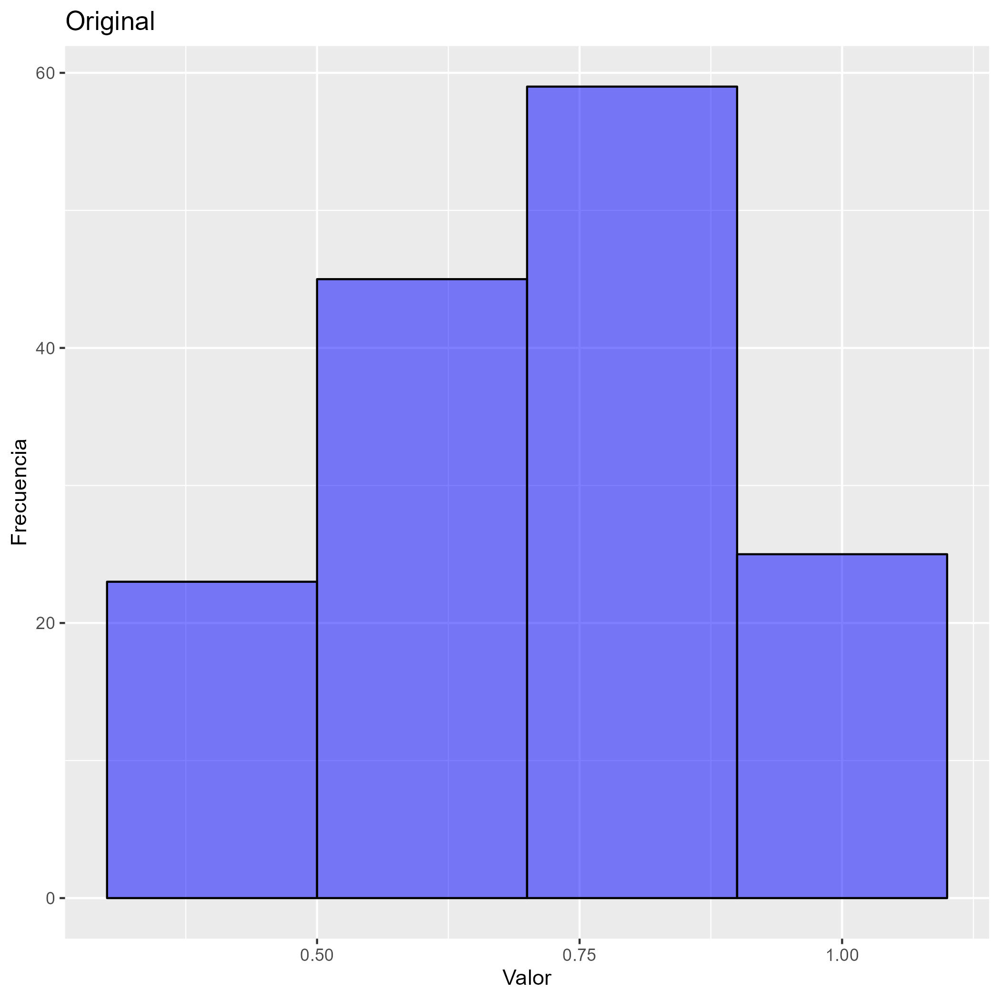

```{r}
#Carga de librerias
library("ggplot2")
library("gridExtra")
library("tidyverse")
library("tidyr")
source("depuración_ONU.R")

#Carga data frame para analisis descriptivo
bbdd_descrip <- datos_juntos_sinNA %>%
  select(codigo, Pais,dim_econ,gnipc2_2019,gini)

colnames(bbdd_descrip) <- c("Codigo","Pais","Dim_Econ","PBIPC","G")

```

# Indice Economico

PBIPC = PBI Per capita (Acotado en maximo y minimo seleccionados)
G = Indice de Gini

## Calculo actual 
$$\frac{\ln(PBIPC)-\ln(100)}{\ln(75000)-\ln(100)}$$

## Opcion 1) 

PBIPCA = PBI Per cápita ajustado por Ginni
$$PBIPCA = PBIPC * (1-G/100)$$

$$\frac{\ln(PBIPCA)-\ln(100)}{\ln(75000)-\ln(100)}$$


```{r}
#Creacion nuevo indice economico1
bbdd_descrip$PBIPCA <- bbdd_descrip$PBIPC * (1- bbdd_descrip$G / 100)
bbdd_descrip$Dim_Econ1 <- (log(bbdd_descrip$PBIPCA)-log(100))/(log(75000)-log(100))


#Boxplot

#Formato largo
bbddescrip_nuevo <- data.frame(
  idpais = rep(bbdd_descrip$Codigo, 2),
  valor = c(bbdd_descrip$Dim_Econ, bbdd_descrip$Dim_Econ1),
  tipo_variable = rep(c("indice0", "indice1"), each = nrow(bbdd_descrip)) 
)
options(device = "jpeg")  # Establecer el dispositivo gráfico a JPEG

boxecon_1 <- ggplot(bbddescrip_nuevo) +
  geom_boxplot(aes(x = tipo_variable, y = valor, fill = tipo_variable)) +
  labs(title = "Comparación indice económico original y opción 1", x = "Indice", y = "Valor") + scale_fill_manual(values = c("blue", "red")) +
  theme(axis.text.x = element_text(angle = 45, hjust = 1))

# Guardar el gráfico en un archivo JPEG con un nombre específico
ggsave("descriptivo/boxplot_comparacion1_1.jpg", plot = boxecon_1)


# Histograma
# Original
histindice0_1 <- ggplot(bbdd_descrip, aes(x = Dim_Econ)) +
  geom_histogram(binwidth = 0.2, fill = "blue", color = "black", alpha = 0.5) +  # Agregar líneas alrededor de las barras
  labs(title = "Original", x = "Valor", y = "Frecuencia")


ggsave("descriptivo/histograma_0_1.jpg", plot = histindice0_1)


# Opcion1
histindice1_1 <- ggplot(bbdd_descrip, aes(x = Dim_Econ1)) +
  geom_histogram(binwidth = 0.2, fill = "blue", color = "black", alpha = 0.5) +  # Agregar líneas alrededor de las barras
  labs(title = "Opcion 1", x = "Valor", y = "Frecuencia")

ggsave("descriptivo/histograma_1_1.jpg", plot = histindice1_1)

# Calcula la correlación entre dos variables
correlacion1_1 <- cor(bbdd_descrip$Dim_Econ, bbdd_descrip$Dim_Econ1)

# Muestra la correlación
print(correlacion1_1)


```





## Opcion 2)

$$\frac{\ln(PBIPC)-\ln(100)}{\ln(75000)-\ln(100)} * (1-G/100)$$
```{r}
#Creacion nuevo indice economico1
bbdd_descrip$Dim_Econ2 <- bbdd_descrip$Dim_Econ*(1-bbdd_descrip$G/100)


#Boxplot

#Formato largo
bbddescrip_nuevo <- data.frame(
  idpais = rep(bbdd_descrip$Codigo, 2),
  valor = c(bbdd_descrip$Dim_Econ, bbdd_descrip$Dim_Econ2),
  tipo_variable = rep(c("indice0", "indice2"), each = nrow(bbdd_descrip)) 
)
options(device = "jpeg")  # Establecer el dispositivo gráfico a JPEG

boxecon_2 <- ggplot(bbddescrip_nuevo) +
  geom_boxplot(aes(x = tipo_variable, y = valor, fill = tipo_variable)) +
  labs(title = "Comparación indice económico original y opción 2", x = "Indice", y = "Valor") + scale_fill_manual(values = c("blue", "red")) +
  theme(axis.text.x = element_text(angle = 45, hjust = 1))

# Guardar el gráfico en un archivo JPEG con un nombre específico
ggsave("descriptivo/boxplot_comparacion1_2.jpg", plot = boxecon_2)


# Histograma


# Opcion2
histindice1_2 <- ggplot(bbdd_descrip, aes(x = Dim_Econ2)) +
  geom_histogram(binwidth = 0.2, fill = "blue", color = "black", alpha = 0.5) +  # Agregar líneas alrededor de las barras
  labs(title = "Opcion 2", x = "Valor", y = "Frecuencia")

ggsave("descriptivo/histograma_1_2.jpg", plot = histindice1_2)

# Calcula la correlación entre dos variables
correlacion1_2 <- cor(bbdd_descrip$Dim_Econ, bbdd_descrip$Dim_Econ2)

# Muestra la correlación
print(correlacion1_2)


```


## Opcion 3) 

Aquellos valores de índice de Ginni que tengan valores menores a 0.3 se les asigna 0.3

PBIPCA = PBI Per cápita ajustado por Ginni
$$PBIPCA = PBIPC * (1-G/100)$$

$$\frac{\ln(PBIPCA)-\ln(100)}{\ln(75000)-\ln(100)}$$

```{r}
#Creacion nuevo indice economico1
bbdd_descrip$G_30 <- ifelse(bbdd_descrip$G >= 30, bbdd_descrip$G, 30)

bbdd_descrip$PBIPCA_30 <- bbdd_descrip$PBIPC * (1- bbdd_descrip$G_30 / 100)
bbdd_descrip$Dim_Econ3 <- (log(bbdd_descrip$PBIPCA_30)-log(100))/(log(75000)-log(100))


#Boxplot

#Formato largo
bbddescrip_nuevo <- data.frame(
  idpais = rep(bbdd_descrip$Codigo, 2),
  valor = c(bbdd_descrip$Dim_Econ, bbdd_descrip$Dim_Econ3),
  tipo_variable = rep(c("indice0", "indice3"), each = nrow(bbdd_descrip)) 
)
options(device = "jpeg")  # Establecer el dispositivo gráfico a JPEG

boxecon_3 <- ggplot(bbddescrip_nuevo) +
  geom_boxplot(aes(x = tipo_variable, y = valor, fill = tipo_variable)) +
  labs(title = "Comparación indice económico original y opción 3", x = "Indice", y = "Valor") + scale_fill_manual(values = c("blue", "red")) +
  theme(axis.text.x = element_text(angle = 45, hjust = 1))

# Guardar el gráfico en un archivo JPEG con un nombre específico
ggsave("descriptivo/boxplot_comparacion1_3.jpg", plot = boxecon_3)


# Histograma

# Opcion3
histindice1_3 <- ggplot(bbdd_descrip, aes(x = Dim_Econ3)) +
  geom_histogram(binwidth = 0.2, fill = "blue", color = "black", alpha = 0.5) +  # Agregar líneas alrededor de las barras
  labs(title = "Opcion 3", x = "Valor", y = "Frecuencia")

ggsave("descriptivo/histograma_1_3.jpg", plot = histindice1_3)

# Calcula la correlación entre dos variables
correlacion1_3 <- cor(bbdd_descrip$Dim_Econ, bbdd_descrip$Dim_Econ3)

# Muestra la correlación
print(correlacion1_3)


```


## Opcion 4)

Aquellos valores de índice de Ginni que tengan valores menores a 0.3 se les asigna 0.3

$$\frac{\ln(PBIPC)-\ln(100)}{\ln(75000)-\ln(100)} * (1-G/100)$$

```{r}
#Creacion nuevo indice economico1
bbdd_descrip$Dim_Econ4 <- bbdd_descrip$Dim_Econ*(1-bbdd_descrip$G_30/100)


#Boxplot

#Formato largo
bbddescrip_nuevo <- data.frame(
  idpais = rep(bbdd_descrip$Codigo, 2),
  valor = c(bbdd_descrip$Dim_Econ, bbdd_descrip$Dim_Econ4),
  tipo_variable = rep(c("indice0", "indice4"), each = nrow(bbdd_descrip)) 
)
options(device = "jpeg")  # Establecer el dispositivo gráfico a JPEG

boxecon_4 <- ggplot(bbddescrip_nuevo) +
  geom_boxplot(aes(x = tipo_variable, y = valor, fill = tipo_variable)) +
  labs(title = "Comparación indice económico original y opción 3", x = "Indice", y = "Valor") + scale_fill_manual(values = c("blue", "red")) +
  theme(axis.text.x = element_text(angle = 45, hjust = 1))

# Guardar el gráfico en un archivo JPEG con un nombre específico
ggsave("descriptivo/boxplot_comparacion1_4.jpg", plot = boxecon_4)


# Histograma


# Opcion2
histindice1_4 <- ggplot(bbdd_descrip, aes(x = Dim_Econ4)) +
  geom_histogram(binwidth = 0.2, fill = "blue", color = "black", alpha = 0.5) +  # Agregar líneas alrededor de las barras
  labs(title = "Opcion 4", x = "Valor", y = "Frecuencia")

ggsave("descriptivo/histograma_1_4.jpg", plot = histindice1_4)

# Calcula la correlación entre dos variables
correlacion1_4 <- cor(bbdd_descrip$Dim_Econ, bbdd_descrip$Dim_Econ4)

# Muestra la correlación
print(correlacion1_4)


```


