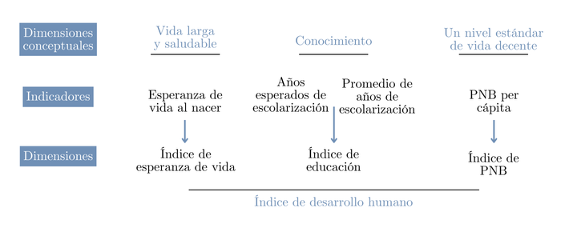
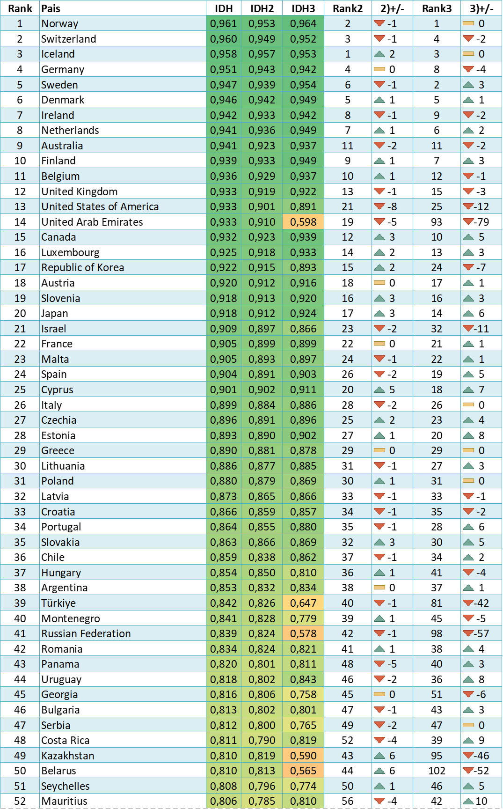
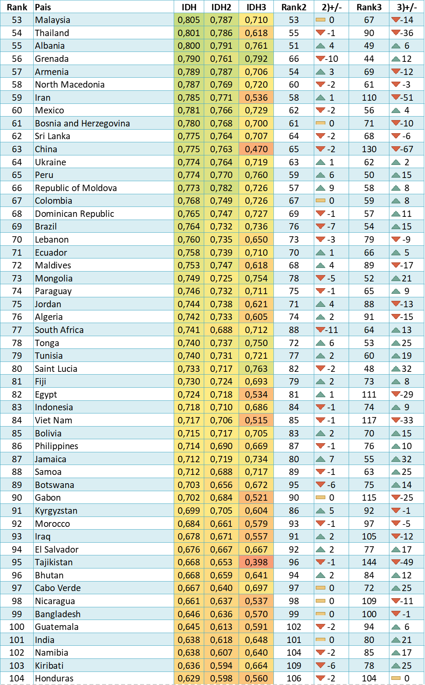
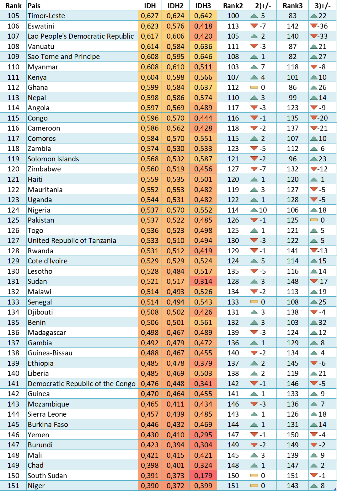
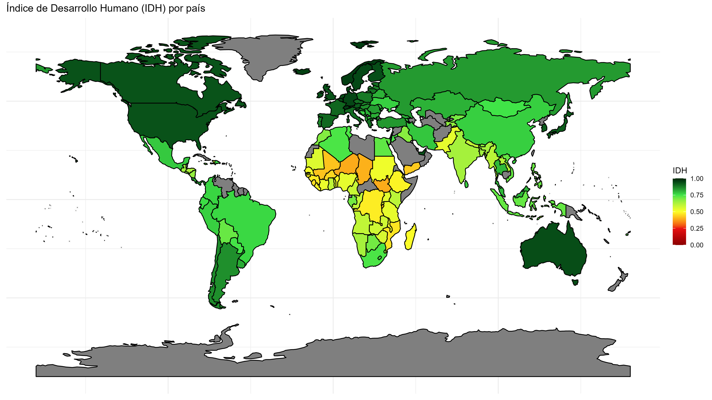
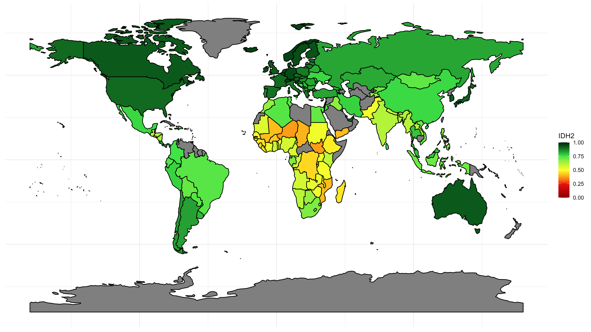
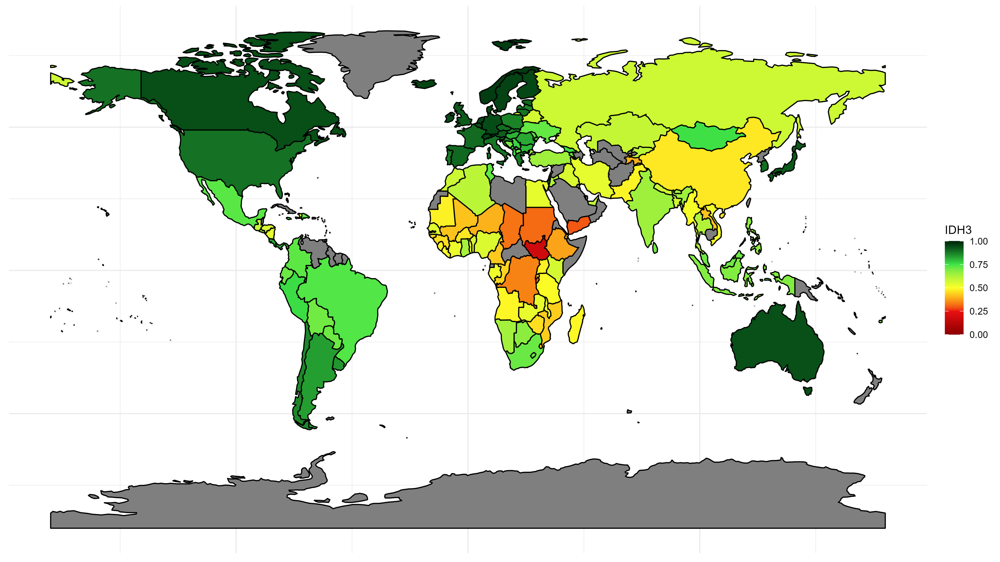
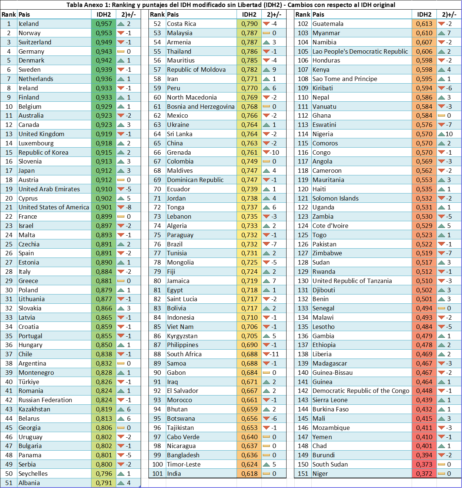
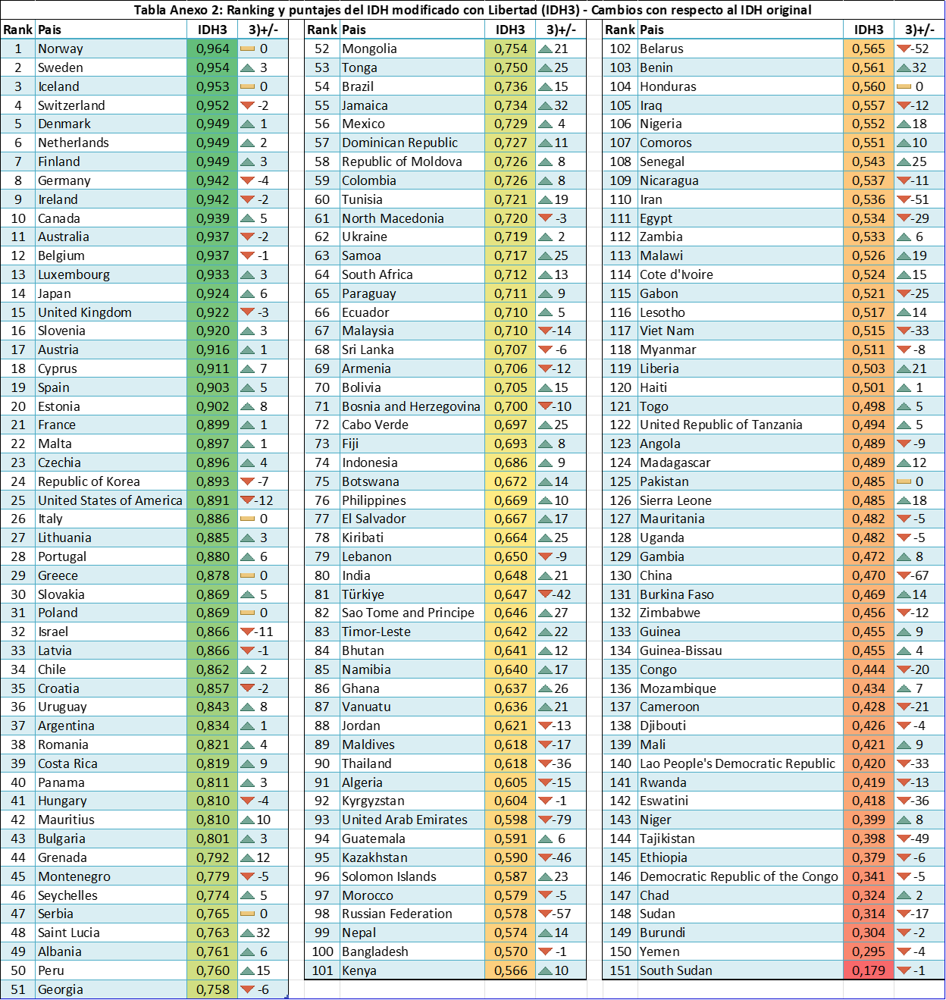

\renewcommand{\figurename}{Figura}
```{=tex}
\begin{center}
    \vspace*{0.5cm}
    \Huge\textbf{Modificaciones para el índice de desarrollo humano}
    
    \vspace{4cm}
    \includegraphics[width=0.2\textwidth]{logo_fceye.png}
  
    \vspace{0cm}
    \large{Facultad de Ciencias Económicas y Estadística, Universidad Nacional de Rosario}
    
    \vspace{0.5cm}
    \large{Alfonsina Badin, Ailén Salas, Augusto Raynaudo, Camila Matellicani, Julián L'heureux, Sofia Giaquinta}
    
    \vspace{0.5cm}
    \large{Junio 2024}
    
\end{center}
```
\clearpage

```{r include=FALSE}
source("resultados.R")
```


# Introducción

El desarrollo humano es un aspecto sumamente importante para la vida de las personas y, a nivel país, es un indicador de ciertas características del territorio, de acciones políticas y las oportunidades que alcanza. Este se identifica con la idea de ampliar la riqueza de la vida humana, y no simplemente la riqueza de la economía en la que viven los seres humanos. Es un enfoque centrado en las personas, en sus oportunidades y opciones.

En lugar de dar por sentado que el crecimiento económico conducirá automáticamente a un mayor bienestar para todas las personas, el desarrollo humano se enfoca en mejorar sus vidas en un sentido más amplio, haciendo del crecimiento de los ingresos un medio para el desarrollo, más que un fin en sí mismo. Bajo esta premisa, se tienen en cuenta también aspectos que impliquen desarrollar las capacidades de las personas, brindando la oportunidad y la libertad de utilizarlas, sin insistir en que las aprovechen.

En 1990, el Programa de las Naciones Unidas para el Desarollo calcula por primera vez un indicador del desarrollo humano bajo la definición mencionada, denominado Índice de Desarrollo Humano (IDH). Este es un indicador compuesto, extensamente utilizado a nivel internacional, que relaciona tres dimensiones para dar cuenta del grado de oportunidad efectiva de expandir las capacidades de las personas: una vida larga y saludable, el acceso al conocimiento y el tener un nivel estándar de vida decente. Es una forma de obtener el promedio de los logros de un área geográfica específica.

Para calcularlo, se toman las variables esperanza de vida, años esperados de escolaridad, años promedio de escolaridad y producto bruto nacional (PNB) per cápita de cada país. Se propone cuestionar el uso de estas variables o si es necesario incluir nuevas en el cálculo, ya que gracias a la facilidad que Internet ofrece, se podrían tener en cuenta nuevas medidas de fácil acceso.

El objetivo principal de la presente investigación es proponer una modificación para el IDH de forma que refleje, en un sentido más integrado, la naturaleza de cada país en relación al desarrollo humano. Dada la definición de desarrollo humano antes mencionada, se propone tener en cuenta para el cálculo del IDH también aspectos sobre la sociedad, la discriminación, los derechos, la calidad de vida, desigualdades y las libertades civiles.

\pagebreak

# Índice de desarrollo humano

El IDH se calcula como una media geométrica de índices que representan a las tres dimensiones estudiadas: una vida larga y saludable, el conocimiento y un nivel estándar de vida decente.

 

$$IDH = \Bigl(\text{Índice de esperanza de vida}\times\text{Índice de educación}\times\text{Índice de ingreso}\Bigl)^{1/3}$$

Al considerarse la media geométrica, un mal desempeño en cualquiera de los componentes se refleja directamente en el valor del índice y no existe sustituibilidad perfecta entre ellos. Así, se captura cuán equilibrado es el desempeño de un país en los tres ámbitos.

Todos los índices mencionados se llaman índices de dimensión y se calculan de la siguiente forma:

$$\text{Índice de dimensión}=\frac{\text{valor actual - valor mínimo}}{\text{valor máximo - valor mínimo}}$$

Donde los valores mínimo y máximo están definidos para transformar la variable en un indicador con valores entre 0 y 1 y se llaman "cero natural" y "objetivo aspiracional", respectivamente.

### Vida larga y saludable 

La primera dimensión del IDH es vida larga y saludable, que sin dudas promueve el desarrollo humano y es primordial para mantener un buen estilo de vida. Actualmente, el indicador que representa este aspecto se obtiene a partir de la esperanza de vida al nacer: el número medio de años que un recién nacido podría esperar vivir, si transcurriera su vida expuesto a las tasas de mortalidad específicas por sexo y edad vigentes en el momento de su nacimiento, para un año concreto, en un país, territorio o zona geográfica determinados.

Para el cálculo del IDH se transforma la esperanza de vida al nacer en un índice calculado con el índice de dimensión mencionado anteriormente, para esto se definen valores mínimos y máximos de la esperanza de vida. La elección del cero natural para la esperanza de vida es de 20 años y está basada en evidencia histórica que muestra que ningún país en el siglo 20 ha tenido una esperanza de vida menor a los 20 años. El valor máximo u objetivo aspiracional está definido a los 85 años ya que es un objetivo realista al que muchos países pueden aspirar, especialmente por las constantes mejoras en las condiciones de vida y los avances médicos.

De esta forma, el índice de esperanza de vida se calcula de la siguiente manera:

$$\text{Índice de esperanza de vida} = \frac{\text{Esperanza de vida al nacer}-20}{85-20}$$

## Conocimiento 

En representación de la dimensión del conocimiento, se incluye al cálculo del IDH el índice de educación. Este se calcula como una media aritmética entre dos indicadores de dimensión para las variables años esperados de escolaridad y años promedio de escolaridad.

Los años esperados de escolaridad refieren al número de años de escolaridad que puede esperar recibir un niño en edad de comenzar la escuela, si los patrones vigentes de las tasas de matriculación por edad se mantienen a lo largo de su vida. Y los años medios de escolaridad son el número promedio de años de educación recibidos por las personas de 25 años o más, calculado a partir de los niveles de logros educativos utilizando la duración oficial de cada nivel.

Resulta necesario aclarar que para la rama del conocimiento, al tomarse dos indicadores en vez de uno, primero se calcula el índice de dimensión de ambos y, a continuación, se obtiene la media aritmética de los dos índices resultantes.

$$\text{Índice de años esperados} = \frac{\text{Años esperados de escolaridad}-0}{18-0}$$

$$\text{Índice de años medios} = \frac{\text{Años medios de escolaridad}-0}{15-0}$$

Las sociedades pueden subsistir sin educación formal, lo que justifica la educación mínima de 0 años. El máximo de años esperados de escolaridad, 18, equivale a la obtención de un máster en la mayoría de los países. El máximo de años medios de escolaridad, 15, es el máximo previsto de este indicador para 2025.

El índice de educación queda definido entonces como la media aritmética de los índices mencionados:

$$\text{Índice de educación} = \frac{\text{Índice años esperados de escolaridad}+\text{Índice años medios de escolaridad}}{2}$$

## Nivel estándar de vida decente

Se considera que un nivel estándar de vida se puede alcanzar cuando la nación en la que se reside tiene un alto producto bruto interno per cápita, que refiere al valor monetario de la producción de bienes y servicios de demanda final de un país o región durante un período determinado para cada habitante de la población. Es por eso que el PBI fue la variable considerada en el cálculo del IDH en un principio.

Sin embargo, a partir del año 2010, para medir el nivel de vida, el producto nacional bruto (PNB) per cápita reemplaza al producto interno bruto (PBI) per cápita. Esto se debe a que en un mundo globalizado, suele haber grandes diferencias entre los ingresos de los residentes de un país y su producto interno. Parte de lo que ganan los habitantes se envía al extranjero, algunas personas reciben remesas del exterior y algunos países reciben considerables flujos de ayuda. 

Se define al producto nacional bruto (PNB) per cápita como los ingresos totales de una economía generados por su producción y la propiedad de los factores de producción, menos los ingresos pagados por el uso de factores de producción que son propiedad del resto del mundo, convertidos a dólares internacionales usando las tasas de la PPA, y divididos por la población a mitad del año.

Para comparar el estándar de vida entre los países, los datos deben ajustarse por la paridad del poder adquisitivo (PPA) a fin de eliminar las diferencias en el valor de un dólar entre países. Se entiende por paridad de poder adquisitivo (PPA) al tipo de cambio que refleja las diferencias de precios entre países y permite hacer comparaciones internacionales del producto e ingreso reales. En la tasa de PPA en US\$ (utilizada en este Informe), US\$1 en PPA tiene el mismo poder adquisitivo en la economía de cualquier país que US\$1 en los Estados Unidos de América. 

Para el cálculo de este índice se considera el logaritmo de los valores ya que el PNB tiene una distribución asimétrica. Además, una vez alcanzado determinado nivel de vida se necesitan grandes cambios en el ingreso para mejorarlo aún más, por lo cual se debe atenuar el efecto del aumento de ingresos en países más desarrollados.

En el _IDH_ se calcula el índice de PNB como

$$\text{Índice}_{PNB} = \frac{ln(PNB) - ln(100)}{ln(75000)-ln(100)}$$

El bajo valor mínimo para el Producto Nacional Bruto per cápita se considera en los 100 dólares, el uso de este valor se justifica por la considerable cantidad de producción de subsistencia y producción no comercial no medida en economías cercanas al mínimo, que no se captura en los datos oficiales. Por otro lado, el valor máximo se establece en 75000 dólares per cápita. Kahneman y Deaton (2010) han demostrado que prácticamente no hay ganancia en desarrollo humano y bienestar con un ingreso anual per cápita superior a 75000 dólares. Actualmente, solo cuatro países (Brunei Darussalam, Liechtenstein, Qatar y Singapur) superan el techo de ingresos per cápita de 75000 dólares.

\pagebreak

# Otras alternativas al cálculo del IDH

A través de los años, las Naciones Unidas definieron diversos índices intentando ampliar la precisión del IDH original, agregando variables y modificando cálculos a fines de representar mejor el motivo del análisis. En esta sección se mencionan algunos de ellos:

* **Índice de Desarrollo Humano ajustado por la Desigualdad (IDH-D)**: El IDH-D es una medida que complementa al Índice de Desarrollo Humano (IDH) tradicional al incorporar la desigualdad existente dentro de un país. Tiene en cuenta las desigualdades existentes en las tres dimensiones: salud, educación e ingresos. Para ello, hace uso de la familia de mediciones de desigualdad de Atkinson (1970) y fija el parámetro de aversión $\epsilon$ en uno.

* **Índice de Desarrollo de Género (IDG)**: El IDG refleja las desigualdades entre hombres y mujeres realizando el cálculo de las tres dimensiones básicas de desarrollo humano por género, y luego calcula una razón entre el IDH de las mujeres y el de los hombres. 

* **Índice de Desigualdad de Género (IDG-D)**: El IDG-D refleja la desigualdad en tres dimensiones: salud reproductiva, medida por la tasa de mortalidad materna y la tasa de natalidad entre las adolescentes; empoderamiento, medido por el porcentaje de regidoras y regidores, y la población con al menos algún tipo de educación secundaria; mercado de trabajo, medido por la tasa de participación en la fuerza de trabajo.

* **Índice de Pobreza Multidimensional (IPM)**: El Índice de Pobreza Multidimensional (IPM) identifica múltiples privaciones individuales en materia de educación, vivienda y uso de internet, salud y protección social. Cada persona de un determinado hogar se clasifica en situación de pobreza o no, dependiendo de la cantidad de privaciones a las que está sometida su familia.

Estos son utilizados como punto de partida de nuestra búsqueda y propuestas para un nuevo IDH ajustado que integre aspectos sobre la sociedad, sus derechos y libertades, calidad de vida, desigualdades, etc. 

\pagebreak 

# Cuestionamiento

Durante la investigación se debate cada una de las dimensiones que componen el IDH con la finalidad de cuestionarlos e intentar una reformulación que sea más realista para los tiempos que corren.

Si bien se piensa que el cálculo del IDH actual logra reflejar muchas cuestiones vinculadas a lo que hace que un país se pueda considerar con mayor o menor desarrollo humano, hay otros aspectos de lo que se define como desarrollo humano que no son tenidos en cuenta. 

Poniendo el foco en la dimensión de una vida larga y saludable, se puede identificar que en un principio el mismo nombre de esta dimensión no esta completamente explicado por la variable que se utiliza ya que la esperanza de vida solo indicaría si las personas tienen una vida larga o corta, pero no se determina qué tan saludable es. Por esta razón, en esta dimensión se considera importante incorporar otra variable que pueda tener en cuenta las condiciones en las que se vive, en cuanto a salud, en los distintos países. 

En segundo lugar, se menciona que no se toma por sentado que el crecimiento económico conduce a un mayor bienestar para todos sino que los ingresos se consideran un medio para el desarrollo, más que un fin en sí mismo. Esto indica que si bien una medida como el Producto Nacional Bruto podría ser un medio para explicar si un país esta más o menos desarrollado no podría definir esto por completo, ya que el tener un valor alto de PNB no garantizaría el bienestar de toda la población. A partir de esta problemática, surge la idea de implementar otra variable de corrección en esta dimensión para así poder tener en cuenta otras cuestiones del desarrollo humano para el nivel de vida de las personas.

Por otro lado, la definición de desarrollo humano menciona que este consiste en ofrecer oportunidades a las personas, no de insistir en que las aprovechen. Es decir, que las personas tengan la libertad de llevar a cabo la vida que ellos elijan sin imponerles cómo vivirla. Esto no se tiene en cuenta actualmente en el indice ya que no se calcula una dimensión de libertad. Se considera que podría ser una propuesta adecuada incluir una cuarta dimensión al índice de desarrollo humano que tenga en cuenta cuestiones relacionadas con la libertad y los derechos de las personas en su día a día.

\pagebreak

# Propuestas y modificaciones 

En esta sección se explica cada una de las modificaciones propuestas para este nuevo índice, acompañado del razonamiento realizado. Además, se muestran otras posibles propuestas que se podrían llevar a cabo en investigaciones futuras o descartadas del presente informe por diversas razones. 

Para esta investigación se tomó como regla general buscar los datos del 2019. La justificación de esta elección se encuentra detallada en el apartado de Referencias - Origen de los datos. 

## Vida larga y saludable

### Debate

Como se mencionó anteriormente, tener una alta esperanza de vida sin dudas logra una vida larga, pero no necesariamente saludable. Esta variable no proporciona información sobre la calidad de vida en el horizonte de años de vida y si este horizonte se desarrolla con buena salud o, por el contrario, se desarrolla con alguna discapacidad o dependencia. Es por esto que se propone hacer uso de la Esperanza de vida saludable al nacer (o Esperanza de vida en buena salud al nacer) para cuantificar este aspecto según la cantidad de años de calidad y no sólo teniendo en cuenta la longevidad. 

Se considera condición de buena salud a la ausencia de limitaciones funcionales o de discapacidad ya que las enfermedades crónicas, los problemas mentales y la discapacidad física aumentan su prevalencia con la edad y reducen la calidad de vida de las personas que sufren estas condiciones de salud. La esperanza de vida saludable al nacer es una medida que combina información de mortalidad y de morbilidad y se calcula en base al método Sullivan.

El método de Sullivan es un método estadístico que combina la información de las tablas de mortalidad con datos sobre la prevalencia de morbilidades o limitaciones en la actividad. Ajustando las tablas de mortalidad con la prevalencia de morbilidad, se calcula la esperanza de vida saludable, libre de limitaciones, sumando los años de vida ajustados para obtener una medida integral de salud poblacional. Este método proporciona una visión clara de los años que se espera que una persona viva en buena salud, combinando la cantidad y calidad de vida.

En resumen, la organización mundial de la salud define al cálculo de la esperanza de vida saludable al nacer de la siguiente manera: 

$$HALE_x = \Biggl[\sum_{i=x}^w YWD_i\Biggl] \Bigl/ I_x$$

donde: 

- $YWD_x = L_x (1-D_x)$ son los años vividos sin discapacidad entre la edad $x$ y $x+5$

- $I_x$ es el número de sobrevivientes a las edad $x$

- $L_x$ es el total de años vividos entre la edad $x$ y $x+5$ de la tabla de vida 

- $D_x$ es la proporción de gente con discapacidad entre los años $x$ y $x+5$ 

Además, se evaluó la posibilidad de incorporar al cálculo la esperanza de vida y de vida saludable a los 60 años para considerar el impacto de la salud en la población mayor en los distintos países. Sin embargo, se consideró que utilizar únicamente los indicadores al nacer facilita la interpretación de la dimensión. A su vez, estas medidas otorgan una visión más amplia de la longevidad y salud de la población a lo largo de toda su vida.

### Modificación en el cálculo del IDH

La esperanza de vida saludable al nacer se podría considerar una variable que contiene más información e identifica mejor a la dimensión "tener una vida larga y saludable". Ahora bien, ¿cómo incluirla al cálculo del IDH? Se han barajado algunas opciones:

1. Reemplazar la esperanza de vida al nacer por la esperanza de vida saludable al nacer directamente en el cálculo del índice de salud. Para la transformación de dicha métrica en el índice se calculó el mínimo y máximo de esta variable buscando que sea proporcional con el mínimo y máximo de la esperanza de vida al nacer.

$$\text{min}_\text{esp. salud} = \text{min}_\text{esp. vida}*\frac{\min(\text{esp. salud})}{\min(\text{esp. vida})}$$

Siendo:

- $\text{min}_\text{esp. salud}$: valor fijado para el cero natural de la esperanza de vida saludable al nacer.

- $\text{min}_\text{esp. vida}$: valor fijado para el cero natural de la esperanza de vida al nacer (20 años).

- $\min(\text{esp. salud})$: valor mínimo observado de la esperanza de vida saludable al nacer entre los países evaluados.

- $\min(\text{esp vida})$: valor mínimo observado de la esperanza de vida al nacer entre los países evaluados.

De igual manera, se calcula el objetivo aspiracional para la esperanza de vida saludable al nacer. Y, una vez obtenidos ambos valores, se logra calcular el índice de la dimensión salud.

$$\text{Índice de salud*} = \frac{\text{esp. salud}-\min(\text{esp. salud})}{\max(\text{esp. salud})-\min(\text{esp. salud})}$$

```{r Figura1, echo=FALSE, fig.cap="Índice de salud obtenido con la metodología original y la opción 1", fig.height=2, message=FALSE, warning=FALSE}
library(ggplot2)
bbddescrip_nuevo <- readRDS("Figuras Informe/salud_base_box_1.rds")
bbddescrip_nuevo$tipo_variable <- ifelse(bbddescrip_nuevo$tipo_variable == "Indice original","Índice Original","Índice Opción 1")

ggplot(bbddescrip_nuevo) +
  geom_boxplot(aes(x = tipo_variable, y = valor, fill = tipo_variable), alpha = 0.85) +
  labs(x = " ", y = "Valor") + 
  scale_fill_manual(values = c("#d4dff0", "#543786")) +
  theme_minimal() +
  theme(
    text = element_text(family = "serif"),
    axis.title.x = element_text(margin = margin(t = 10)),
    axis.title.y = element_text(margin = margin(r = 10)),
    legend.position = "none"
  ) +
  coord_flip()
```

En la Figura 1 se puede identificar que los resultados del índice de salud para los países en estudio con ambas metodologías no presentan grandes cambios. Se observa que el mínimo del Índice de salud disminuye con el cálculo propuesto. Sin embargo, los datos centrales se posicionan en el mismo rango y el máximo valor parecería mantenerse.

2. Tomar ambas variables y promediarlas. Una vez obtenido el promedio se calcula el índice de este eligiendo el cero natural y el objetivo aspiracional con el criterio utilizado anteriormente. 

$$\text{Promedio}=\frac{\text{esp. vida}+\text{esp salud}}{2} \quad \text{Índice de salud*} = \frac{\text{Promedio}-\min}{\max-\min}$$

```{r echo=FALSE, message=FALSE, warning=FALSE}
library(ggplot2)
bbddescrip_nuevo <- readRDS("Figuras Informe/salud_base_box_2.rds")
bbddescrip_nuevo$tipo_variable <- ifelse(bbddescrip_nuevo$tipo_variable == "Indice original","Índice Original","Índice Opción 2")
```


```{r Figura2, fig.cap="Índice de salud obtenido con la metodología original y la opción 2", fig.height=2, echo=FALSE, message=FALSE, warning=FALSE}


ggplot(bbddescrip_nuevo) +
  geom_boxplot(aes(x = tipo_variable, y = valor, fill = tipo_variable), alpha = 0.85) +
  labs(x = " ", y = "Valor") + 
  scale_fill_manual(values = c("#d4dff0", "#543786")) +
  theme_minimal() +
  theme(
    text = element_text(family = "serif"),
    axis.title.x = element_text(margin = margin(t = 10)),
    axis.title.y = element_text(margin = margin(r = 10)),
    legend.position = "none"
  ) +
  coord_flip()
```

En la Figura 2 se puede identificar que, nuevamente, el cálculo no parece cambiar notablemente los resultados, disminuyendo el mínimo del índice de salud respecto al original y manteniendo datos centrales y el máximo.

3. Penalizar la esperanza de vida al nacer. Esta opción se lleva a cabo transformando la esperanza de vida al nacer y la esperanza de vida saludable al nacer en índices y después multiplicándolos. Como era de esperarse, esto causa que se penalice mucho el valor de la dimensión salud, tal como puede observarse en la Figura 3. Podrían pensarse distintas ponderaciones para aminorar el peso de la esperanza de vida saludable en el cálculo de la dimensión. Sin embargo, para llevarlo a cabo se debería contar con un mayor conocimiento sobre la construcción de índices y el área de salud, por lo cual se decide no utilizar esta opción en el presente informe.

$$\text{Índice de salud*}=\text{Índice de esp. vida}\times\text{Índice de esp. salud}$$

```{r Figura3, fig.cap="Índice de salud obtenido con la metodología original y la opción 3", fig.height=2, echo=FALSE, message=FALSE, warning=FALSE}
library(ggplot2)
bbddescrip_nuevo <- readRDS("Figuras Informe/salud_base_box_3.rds")
bbddescrip_nuevo$tipo_variable <- ifelse(bbddescrip_nuevo$tipo_variable == "Indice original","Índice Original","Índice Opción 3")

ggplot(bbddescrip_nuevo) +
  geom_boxplot(aes(x = tipo_variable, y = valor, fill = tipo_variable), alpha = 0.85) +
  labs(x = " ", y = "Valor") + 
  scale_fill_manual(values = c("#d4dff0", "#543786")) +
  theme_minimal() +
  theme(
    text = element_text(family = "serif"),
    axis.title.x = element_text(margin = margin(t = 10)),
    axis.title.y = element_text(margin = margin(r = 10)),
    legend.position = "none"
  ) +
  coord_flip()
```

4. Otra alternativa resulta al tomar los índices de esperanza de vida al nacer y esperanza de vida saludable al nacer, ya calculados con sus respectivos mínimos y máximos, y promediarlos.

$$\text{Índice de salud*}=\frac{\text{Índice de esp. vida}+\text{Índice de esp. salud}}{2}$$

En la Figura 4 es evidente que la distribución casi no presenta cambios. Estos son aún más pequeños que en los casos anteriores dado que se está utilizando un promedio de los índices lo cuál aminora el efecto de la nueva variable.

```{r Figura4, fig.cap="Índice de salud obtenido con la metodología original y la opción 4", fig.height=2, echo=FALSE, message=FALSE, warning=FALSE}
library(ggplot2)
bbddescrip_nuevo <- readRDS("Figuras Informe/salud_base_box_4.rds")
bbddescrip_nuevo$tipo_variable <- ifelse(bbddescrip_nuevo$tipo_variable == "Indice original","Índice Original","Índice Opción 4")

ggplot(bbddescrip_nuevo) +
  geom_boxplot(aes(x = tipo_variable, y = valor, fill = tipo_variable), alpha = 0.85) +
  labs(x = " ", y = "Valor") + 
  scale_fill_manual(values = c("#d4dff0", "#543786")) +
  theme_minimal() +
  theme(
    text = element_text(family = "serif"),
    axis.title.x = element_text(margin = margin(t = 10)),
    axis.title.y = element_text(margin = margin(r = 10)),
    legend.position = "none"
  ) +
  coord_flip()
```

5. Se podría pensar incoporar también la diferencia entre esperanza de vida al nacer y la esperanza de vida saludable al nacer de alguna manera. Sin embargo, esta idea es más subjetiva ya que valores grandes de esta diferencia se pueden considerar como positivos o negativos dependiendo de que lado se lo vea. Si bien primeramente se pensó que una gran diferencia significaba un país con menor desarrollo ya que simbolizaba que muchos de los años vividos eran en mala salud, luego se pensó que también esta gran diferencia podía simbolizar que el país en cuestión contaba con una gran tecnología y una avanzada medicina que hacía que los pacientes vivan más años a pesar de sus condiciones de salud. Si el desarrollo se plantea por el lado de avances en la humanidad entonces, si la diferencia es grande, se podría considerar como un mayor desarrollo humano, por lo dicho anteriormente. Dada la complejidad y subjetividad de la idea propuesta se decidió no incorporarla pero se deja plasmada la misma para profundizar este análisis en futuras investigaciones.

En base al recorrido realizado, se seleccionó a la Opción 1 como la modificación elegida del cálculo del Índice de Salud. Se consideró que esta alternativa además de reflejar el cambio que se estaba buscando expresar en esta componente (priorizar no solo la cantidad si no la calidad), resulta la de mayor simplicidad a la hora de interpretar la dimensión.

Si bien la distribución de este índice no parece variar demasiado de la original, hay una variación en el puesto de los países según la dimensión salud. Esto se evidencia en el Cuadro 1, donde se pueden visualizar los países con menor esperanza de vida saludable junto al cálculo del Índice Original y el Índice Modificado. La diferencia entre las variables Esperanza de vida y Esperanza de vida saludable ocasionan diferencias en los Índices calculados, que a fin de cuentas generarán el cambio en el cálculo final del IDH para cada país.  

```{r echo=FALSE, warning=FALSE, message=FALSE}
library(dplyr)
library(kableExtra)
bbdd_descrip <- readRDS("Figuras Informe/Base_tabla.rds")

tabla_resultado <- bbdd_descrip %>%
  arrange(Salud_nacer) %>%
  select(Pais, Salud_nacer, Vida_nacer, Dim_Salud, Dim_Salud2) %>%
  head(5)

tabla_resultado <- tabla_resultado %>%
  select(Pais, Vida_nacer, Salud_nacer, Dim_Salud, Dim_Salud2) %>%
  rename(
    `País` = Pais,
    `Esp. vida` = Vida_nacer,
    `Esp. vida saludable` = Salud_nacer,
    `Índice Original` = Dim_Salud,
    `Índice Modificado` = Dim_Salud2
  )

knitr::kable(tabla_resultado,
      align = "c",
      caption = "Resultados del Índice modificado") %>%
  kable_styling(latex_options = "HOLD_position")
``` 

## Conocimiento

Antes del año 2010, en el cálculo del IDH se tenían en cuenta las variables alfabetización y matriculación bruta en la dimensión de conocimiento. A partir de la publicación del Informe de Desarrollo Humano en el año 2010, los años promedio de escolaridad sustituyeron a la alfabetización y la matriculación bruta se replanteó como los años esperados de escolaridad. 

En el 2010, se vio que desde el primer Informe sobre Desarrollo Humano publicado en 1990, los años promedio de escolaridad habían aumentado en dos años y, la proporción bruta de matriculación, en 12 puntos porcentuales. Las tasas de alfabetismo, por su parte, habían crecido de 73% a 84%. Esto significaba que muchos países habían tenido éxito en el campo de la enseñanza, al menos según en las mediciones del IDH convencional. Esto explica una de las principales motivaciones para realizar los ajustes en el campo de conocimiento.

El alfabetismo y los años de instrucción reflejaban el acceso (o la falta del mismo) a la educación por parte del segmento de la población que en su momento habían llegado a la adultez. Por consiguiente, el progreso registrado quizás no refleje los adelantos recientes en escolaridad de los jóvenes. Dadas las mejoras mencionadas en educación, parecía que la falta de habilidades básicas de redacción dejarían de ser un obstáculo importante para acceder al conocimiento.

Los años promedio de escolaridad y los años esperados de escolaridad ilustran mejor el acceso a educación del que gozan los niños, lo cual justifica el cambio en el cálculo de la dimensión. Se piensa que, hoy en día, estas métricas siguen reflejando la situación actual de la educación por lo que se decide no modificar las variables de la rama conocimiento en el presente informe.

Lo ideal sería que las mediciones de la dimensión de conocimiento incorporasen evaluaciones de calidad. Pero las variables halladas que podrían reflejar esta característica de la educación tienen una cobertura baja y una frecuencia irregular. Es por lo dicho anteriormente, que se decide dejar esta dimensión sin modificaciones pero con una propuesta futura de encontrar algún tipo de medición que represente la calidad de la educación en los distintos países.

## Nivel estándar de vida decente

### Debate 

Al utilizar el PNB ajustado por PPA para medir la dimensión de nivel estándar de vida decente se esta tomando en cuenta solamente el desarrollo económico de un país para explicar qué tan bueno es el nivel de vida de este. La definición de desarrollo humano, mencionada al principio del presente informe, establece que el crecimiento económico no necesariamente conduce a un mayor bienestar para todas las personas.

En ciertas situaciones puede haber un país con un gran valor de PNB donde las riquezas no estén distribuidas equitativamente. Es decir, quizás este valor de PNB alto es acumulado por un bajo porcentaje de la población mientras que existe un gran porcentaje de personas que no tienen un nivel de vida decente. El producto nacional bruto no logra reflejar la distribución de los ingresos de un país, es por esta razón que se considera incorporar en esta dimensión el coeficiente de Gini. 

El coeficiente Gini es el indicador más utilizado para medir la desigualdad salarial. Es una herramienta analítica que suele emplearse para medir la concentración de ingresos entre los habitantes de una región, en un periodo de tiempo determinado. Representa con 0 a una igualdad perfecta y con un 100 a una desigualdad perfecta.

Este indicador se calcula como el área entre la curva de Lorenz, representación gráfica de la distribución de los ingresos, y una línea hipotética que representa la igualdad total (área A) dividido el área bajo esta línea de igualdad total (área B). De esta forma el coeficiente de Gini es igual a:
$$Coef\;Gini=\frac{A}{A+B}$$

Esta gráfica se utiliza a través de dos ejes de coordenadas, para identificar de forma sencilla el porcentaje de ingresos que corresponde a un porcentaje de población.

```{r Figura5, fig.cap= "Índice de Gini en un caso hipotético", fig.align='center', echo=FALSE, message=FALSE, warning=FALSE, fig.height=3}
library(ggplot2)
library(dplyr)
library(ineq)
par(family = "serif")

set.seed(2024)

# Datos de ejemplo
renta <- runif(100, min = 1, max = 100)  # Datos de renta
renta <- renta[order(renta)]
poblacion <- seq(1, 100) / 100  # Población acumulada

# Cálculo de la curva de Lorenz
curva_lorenz <- ineq::Lc(renta)$L
poblacion_acumulada <- ineq::Lc(renta)$p

# Datos para el gráfico
data <- data.frame(poblacion = c(0, poblacion_acumulada*100), renta = c(0, curva_lorenz*100))

# Crear el gráfico
ggplot(data, aes(x = poblacion, y = renta)) +
  geom_ribbon(aes(ymin = renta, ymax = poblacion), fill = "#d4dff0", alpha = 0.7) +  # Área de desigualdad
  geom_line(color = "#543786", size = 1.0) +  # Curva de Lorenz
  geom_abline(intercept = 0, slope = 1, color = "#7bb8c0", linetype = "dashed", size = 1.0) +  # Recta de igualdad
  labs(title = "", x = "Población (%)", y = "Renta (%)") +
  geom_segment(aes(x = 80, xend = 60, y = 80, yend =80), color = "#7bb8c0") +
  geom_label(aes(x = 55,y=80,label="Recta de igualdad"), 
             family = "serif",fill = "#7bb8c0", color = "white",
             label.size = 0)+
  geom_segment(aes(x = 60, xend =40, y = 55, yend = 55), color = "#d4dff0") +
  geom_label(aes(x = 35, y = 55, label ="Desigualdad"),
             family = "serif",fill = "#d4dff0", color = "white",
             label.size = 0) +
  geom_segment(aes(x = 50, xend =60, y = 25, yend = 25), color = "#543786") +
  geom_label(aes(x = 70, y = 25, label ="Curva de Lorenz"),
             family = "serif",fill = "#543786", color = "white",
             label.size = 0) +
  geom_label(aes(x = 43, y = 30, label ="Área A"),
             family = "serif",fill = "#d4dff0", color = "black",
             label.size = 0) +
  geom_label(aes(x = 90, y = 45, label ="Área B"),
             family = "serif", color = "black",
             label.size = 0) +
  theme_minimal() +
  theme(
    text = element_text(family = "serif"),
    axis.title.x = element_text(margin = margin(t = 10)),
    axis.title.y = element_text(margin = margin(r = 10))
  )
```

Para comprender la lógica, se puede observar en la Figura 5 que el 50% de la población alcanza un 25% del ingreso mientras que un 75% de la población llega a más del 50% del ingreso, es decir, el ingreso que logra el 50% de la población lo alcanza el 25% contiguo, lo cual indica desigualdad ya que el ingreso no estaría equitativamente distribuido.

Se propone incorporar el índice de Gini al cálculo del IDH como $(1-\frac{GINI}{100})$ para que en un país más desigual en términos salariales se disminuya el valor de la dimensión de nivel estándar de vida decente.

### Modificación en el cálculo del IDH

A continuación se presentan las distintas maneras de incorporar el coeficiente de Gini al cálculo de la dimensión de nivel estándar de vida decente analizadas.

1. Se planteo multiplicar $1-\frac{GINI}{100}$  por el PNB de cada país y luego convertir la métrica resultante en un índice. Para ello se consideró el cero natural del cálculo del índice de PNB y como objetivo aspiracional se tomó el valor máximo observado de la nueva variable calculada. De esta forma el cálculo es el siguiente:

$$PNB_{Gini} = PNB * \left(1-\frac{GINI}{100}\right)$$

$$\text{Índice de ingreso*}=\frac{\ln(PNB_{Gini})-\ln(100)}{\ln(\max(PNB_{Gini}))-\ln(100)}$$

```{r Figura6, fig.cap="Índice de PNB obtenido con la metodología original y la opción 1", fig.height=2, echo=FALSE, message=FALSE, warning=FALSE}
bbddescrip_nuevo <- readRDS("Figuras Informe/econ_base_box_1.rds")
bbddescrip_nuevo$tipo_variable <- ifelse(bbddescrip_nuevo$tipo_variable == "Indice Original","Índice Original","Índice Opción 1")

ggplot(bbddescrip_nuevo) +
  geom_boxplot(aes(x = tipo_variable, y = valor, fill = tipo_variable)) +
  labs(x = "Indice", y = "Valor") + 
  scale_fill_manual(values = c("#d4dff0", "#543786")) +
  theme_minimal() +
  theme(
    text = element_text(family = "serif"),
    axis.title.x = element_text(margin = margin(t = 10)),
    axis.title.y = element_text(margin = margin(r = 10)),
    legend.position = "none"
  ) +
  coord_flip()
```

Esta modificación del cálculo, en comparación con el original, devuelve valores menores y cambian sus medidas descriptivas de posición, como la mediana, lo cual da indicio de que la posición de los países podría cambiar. Esto se puede observar en la Figura 6.

2. Una segunda opción considerada fue calcular el índice de PNB y luego multiplicarlo por $1-\frac{GINI}{100}$. Esta opción disminuía demasiado los valores de esta dimensión por lo que también se probó aplicarle la raíz a $1-\frac{GINI}{100}$, logrando que tenga menos peso esta penalización.

```{r Figura7, fig.cap="Índice de PNB obtenido con la metodología original y los diferentes enfoques de la opción 2", fig.height=3, echo=FALSE, message=FALSE, warning=FALSE}
bbddescrip_nuevo <- readRDS("Figuras Informe/econ_base_box_2.rds")
bbddescrip_nuevo$tipo_variable <- ifelse(bbddescrip_nuevo$tipo_variable == "Indice Original","Índice Original",ifelse(bbddescrip_nuevo$tipo_variable == "Indice Opcion 2 sin raiz", "Índice Opción 2 sin raíz", "Índice Opción 2 con raíz"))

ggplot(bbddescrip_nuevo) +
  geom_boxplot(aes(x = tipo_variable, y = valor, fill = tipo_variable)) +
  labs(x = "Indice", y = "Valor") +
  scale_fill_manual(values = c("#d4dff0", "#543786", "#543786")) +
  theme_minimal() +
  theme(
    text = element_text(family = "serif"),
    axis.title.x = element_text(margin = margin(t = 10)),
    axis.title.y = element_text(margin = margin(r = 10)),
    legend.position = "none"
  ) +
  coord_flip()
```

$$\text{Índice de ingreso*} = \text{Índice de PNB} \times \sqrt{1-\frac{GINI}{100}}$$

En la Figura 7 se puede observar el cambio abrupto mencionado al no utilizar la raíz en la corrección y cómo la incorporación de la misma diminuye esta penalización. De todas formas, el cambio con esta opción continúa siendo abrupto en comparación con la opción 1. 

Después de analizar ambas opciones, se consideró mejor la multiplicación del coeficiente de Gini previo al cálculo del índice, es decir la opción 1. Puesto que los valores de la segunda opción resultan ser considerablemente menores. Además, otro factor importante es que se intenta que los índices de cada dimensión puedan tomar un valor cercano 1 y esta alternativa no permite esta opción por la naturaleza de su cálculo.  

En el Cuadro 2 donde se muestran los 5 países con menor PNB ajustado por Gini, puede visualizarse que hay una variación en el puesto de los países al comparar el Índice Original y el Modificado. Los cambios con el índice modificado aplican una penalización en el cálculo del IDH a aquellos países que no reparten equitativamente sus ingresos.

```{r echo=FALSE, warning=FALSE, message=FALSE}
library(dplyr)
library(kableExtra)
library(readxl)
bbdd_descrip <- read_xlsx("bbdd_descrip.xlsx")

tabla_resultado <- bbdd_descrip %>%
  arrange(GNIPCA) %>%
  select(Pais, GNIPC, GNIPCA, Dim_Econ, Dim_Econ1) %>%
  head(5)

tabla_resultado <- tabla_resultado %>%
select(Pais, GNIPC, GNIPCA, Dim_Econ, Dim_Econ1) %>%
  rename(
    `País` = Pais,
    `PNB` = GNIPC,
    `PNB ajustado Gini` = GNIPCA,
    `Índice Original` = Dim_Econ,
    `Índice Modificado` = Dim_Econ1
  )

knitr::kable(tabla_resultado,
      align = "c",
      caption = "Resultados del Índice modificado") %>%
  kable_styling(latex_options = "HOLD_position")
``` 

## Una nueva rama para el IDH: Libertad, derechos políticos y libertades civiles

### Debate 

A pesar de la importancia de las métricas económicas, índices de salud y de educación, el IDH no considera un aspecto relevante del desarrollo humano: la libertad. En esta sección se propone implementar este concepto como una nueva dimensión, entendiendo como libertad al pleno ejercicio de los derechos políticos y de las libertades civiles, bajo un régimen libre, democrático y plural. La libertad permite a las personas tomar decisiones sobre sus vidas, perseguir sus objetivos y contribuir a la sociedad. La falta de ella puede obstaculizar el acceso a la educación, la salud y otras oportunidades, perpetuando desigualdades.

Los mismos autores del IDH reconocieron, en el informe de desarollo humano de 2010, que el cálculo no contaba con una “medida cuantitativa de la libertad humana”. 

### Modificación en el cálculo del IDH

Se propone un enfoque innovador que complemente a las dimensiones existentes del IDH: salud, educación y PNB per cápita. Al incorporar la libertad, el IDH puede reflejar una imagen más completa del bienestar de las naciones, teniendo en cuenta cuestiones sociales que no están contempladas actualmente.

Si bien la incorporación de la libertad como nueva dimensión del desarrollo humano puede generar debates sobre su naturaleza ideológica o subjetiva, se piensa que su inclusión es necesaria para medir el progreso de una nación y el bienestar de sus habitantes. Se busca implementar una metodología que cuantifique estas problemáticas, mediante un índice que permita una evaluación integral y completa de cada territorio, considerando sus particularidades.

Para su aplicación se toma el índice de libertad “Freedom in the World”, publicado por la organización Freedom House. La misma es una ONG estadounidense fundada en 1941 con el fin de reunir políticos y al público del país en torno a la lucha contra la Alemania nazi y para crear conciencia sobre la amenaza fascista a la seguridad y a los valores estadounidenses. En las décadas posteriores, Freedom House se estableció, a través de sus programas e investigaciones, como la principal organización estadounidense dedicada al apoyo y la defensa de la democracia y la libertad en todo el mundo. A pesar de que esta visión tiene un enfoque puramente occidental, se considera su inclusión dado que es una medida abarcativa de esta problemática.

Este puntaje se centra en dos ejes principales, derechos políticos y libertades civiles, y tiene en cuenta los siguientes factores:

#### Derechos políticos

* **Proceso electoral**: elecciones que cumplen con estándares democráticos reconocidos, transparentes, libres, universales, etc.

* **Pluralismo y participación política**: ausencia de obstáculos o restricciones discriminatorias, intimidación, violencia contra miembros o líderes políticos; oportunidad realista de alternancia en el poder; elecciones libres de poderes externos; diversos segmentos de la población (incluidos grupos étnicos, raciales, religiosos, de género, LGBT+ y otros relevantes) tienen plenos derechos políticos, oportunidades electorales, etc.

* **Funcionamiento del gobierno**: se evalúa si los representantes elegidos libremente pueden determinar las políticas del gobierno sin interferencia de actores estatales y no estatales en la adopción y ejecución de políticas, así como el control de las fuerzas armadas y la influencia extranjera sobre las decisiones gubernamentales; la existencia de mecanismos efectivos contra la corrupción y la transparencia de las decisiones tomadas. 

#### Libertades civiles

* **Libertad de expresión y creencias**: medios de comunicación libres e independientes; libertad de culto en público y privado; libertad académica, educación libre de adoctrinamiento político; libertad de expresión sin represalias.

* **Derecho de asociación y organización**: se evalúa si las protestas pacíficas están prohibidas o restringidas; si existe libre funcionamiento de las ONG; libertad para los sindicatos y asociaciones laborales sin interferencia del gobierno, y sin presiones de parte de los sindicatos hacia los trabajadores; derecho de huelga.

* **Estado de derecho**: poder judicial independiente; asignación y destitución de jueces de manera justa e imparcial; prevalece el debido proceso, defendiendo los derechos del acusado y de la población carcelaria; protección contra el uso ilegítimo de la fuerza física de parte de las fuerzas policiales; igualdad ante la ley y ausencia de discriminación legal o de facto para grupos étnicos, raciales, religiosos, de género, LGBT+ y otros.

* **Autonomía personal y derechos individuales**: libertad de circulación; derecho de propiedad; igualdad de oportunidades, derechos laborales y movilidad social; tiene en consideración la existencia de violencia doméstica, mutilación genital femenina, abuso sexual y violación, con justicia efectiva para los perpetradores; si el gobierno impone restricciones sobre anticonceptivos o aborto; si se controla la vestimenta, la expresión de género o prohibe el matrimonio igualitario; si interviene en la elección de parejas o relaciones personales mediante leyes restrictivas, si garantiza igualdad en procedimientos de divorcio y custodia, y si protege las libertades personales frente a instituciones privadas o grupos sociales.

* **Derechos políticos discrecionales**: indaga si el gobierno o una potencia ocupante están alterando deliberadamente la composición étnica de un país o territorio para destruir una cultura o inclinar el equilibrio político a favor de otro grupo.

### Cálculo del nuevo índice

Esta dimensión está formada por 25 indicadores relacionados a los factores descritos anteriormente. Los puntajes de cada uno de ellos son definidos por un equipo de analistas internos y externos de la organización y de asesores expertos de comunidades académicas y de derechos humanos. Ellos usan una gran variedad de recursos que incluyen artículos de noticias, análisis académicos, reportes de ONGs e investigaciones del campo en estudio. El puntaje se determina basándose en las condiciones o eventos dentro del país en un año determinado. El producto final se define a partir del consenso de los analistas quienes proponen puntajes que son discutidos y defendidos a través de una serie de encuentros del equipo nombrado dentro de Freedom House. 

Cada uno de los indicadores toma un valor discreto de 0 a 4, formando un puntaje para cada país y territorio. La pregunta relacionada con los derechos políticos discrecionales penaliza dicho puntaje obtenido con el resto de las preguntas, restando hasta 4 puntos. De esto surge un puntaje, en principio de 0 a 100 por país, que es dividido por 100 e incorporado al IDH como una nueva rama independiente de las ya existentes, con el mismo peso.

Para su incorporación al IDH propuesto, surge el debate entre incorporar a todas las preguntas o incluir sólo las referidas a las libertades civiles. De esta manera, se dejaría de lado a las que se refieren al tipo de gobierno adoptado de cada territorio por las diferencias culturales que existen entre las distintas regiones del mundo, que pueden influir en los sistemas de gobierno adoptados. Al comparar el puntaje recibido únicamente referido a derechos políticos con el puntaje de libertades civiles se obtiene una alta correlación (0.96), por lo que muy posiblemente se llegue a los mismos resultados. Además de eso, en este informe se considera a los valores democráticos y al Estado de derecho como factores positivos para el pleno desarrollo humano y para posibilitar el ejercicio del bienestar del mismo, por lo tanto, se decide incorporar a la totalidad de las preguntas en este indicador.

A pesar de que este índice posee cierto grado de subjetividad con tendencia a la ideología estadounidense, este fue el resultado de una búsqueda profunda de una medida que logre cuantificar la presente dimensión y que sea comparable en los distintos países. Lo ideal sería poder formar un índice con un enfoque más objetivo considerando indicadores que demuestren concretamente las libertades de una población. Sin embargo, dada la falta de variables que logren abarcar esta amplia problemática y que estén cuantificadas en variedad de países, sumado a la complejidad que conllevaría formar este índice desde cero, este acercamiento es una buena aproximación de lo que se considera como un ideal de un país libre y democrático. Queda propuesto el análisis de esta nueva dimensión para una futura investigación.

\pagebreak

# IDH modificado: implementación de las propuestas

Los índices elegidos resultan:

-	Índice de salud: reemplazar la esperanza de vida al nacer por la esperanza de vida saludable al nacer.

$$\text{Índice de salud*} = \frac{\text{esp. vida saludable}-17.41872}{74.75077-17.41872}$$

-	Índice económico: multiplicar $1-\frac{GINI}{100}$  por el PNB de cada país y luego convertir la métrica resultante en un índice.

$$PNB_{Gini} = PNB \times \left(1-\frac{GINI}{100}\right)$$

$$\text{Índice del ingreso*}=\frac{\ln(PNB_{Gini})-\ln(100)}{\ln(53377.0398)-\ln(100)}$$

-	Índice de Conocimiento: permanece sin modificaciones.

-	Índice de Libertad: se toma en consideración a la totalidad de las preguntas realizadas en el índice de libertad “Freedom in the World” del año 2019, publicado por la organización Freedom House.

$$\text{Índice de libertad } = Puntaje/100$$

Una vez obtenido los índices de cada dimensión, se decide calcular dos nuevos índices de Desarrollo Humano, uno sin incluir a la nueva rama de Libertad y otro que la incluya. Se toma esta decisión para observar cómo las modificaciones a las ramas ya existentes del IDH alteran los resultados y, por otro lado, evaluar si la inclusión de esta nueva dimensión cambia las conclusiones, sugiriendo que hasta ahora podría haberse estado ignorando un aspecto crucial del desarrollo humano.

Los nuevos IDH modificados se calculan mediante una media geométrica de los respectivos índices obtenidos, de igual forma que en el IDH original.

Índice sin Libertad:
$$IDH_\text{sin libertad} = (\text{Índice de salud*}\times\text{Índice de educación}\times\text{Índice del ingreso*})^{1/3}$$

Índice con Libertad:
$$IDH_\text{con libertad} = (\text{Índice de salud*}\times\text{Índice de educación}\times\text{Índice del ingreso*}\times\text{Índice de libertad})^{1/4}$$

Cabe aclarar que los países que presentan al menos un valor faltante de las variables consideradas en el estudio fueron descartados del mismo. Al recolectar todos los datos para el año 2019 finalmente se cuenta con 151 países de un total de 195 para los cuales fue calculado el IDH original en el Informe de Desarrollo Humano del mismo año. 

# Resultados

Una vez determinadas todas las modificaciones de las dimensiones, se procede a aplicarlas al cálculo de los IDH modificados mencionados en la sección anterior. Se denomina `IDH2` al índice con modificaciones sin Libertad e `IDH3` al que sí incluye a la nueva dimensión. 

Los resultados obtenidos se muestran en la siguiente tabla, donde los países se encuentran ordenados según el IDH original. Se incluyen los 3 índices con una escala de color, sus respectivos ranqueos y cambios de puestos.

\pagebreak

Tabla 1: Índices de Desarrollo Humano por país

```{r tabla1, echo=FALSE, fig.align='center', out.width='75%'}

```

\pagebreak

```{r tabla2, echo=FALSE, fig.align='center', out.width='85%'}

```
\pagebreak

```{r tabla3, echo=FALSE, fig.align='center', out.width='85%'}

```

\pagebreak

La escala de color es de gran ayuda para facilitar la visualización de las variaciones en los países. Por ejemplo, en la parte superior del ranking, destacan países como Emiratos Árabes Unidos, donde se observa claramente cómo la incorporación de la dimensión Libertad afecta en gran medida su puntaje. Por otro lado, países como Costa Rica, Uruguay y Chile suben su puntaje al agregar esta dimensión. 

Se encuentran anexadas al final del informe las tablas con los países ordenados según estas nuevas propuestas del IDH. 

Además, se muestran mapas con los países coloreados según una escala continua del IDH, poniendo como mínimo al 0 y como máximo al 1. 

```{r mapa1, echo=FALSE, fig.align='center', fig.cap="Índice de Desarrollo Humano original por país", out.width='100%' }

```

Inicialmente, en cuanto al IDH original, se puede observar que en América la mayoría de los países toman valores altos de desarrollo humano, principalmente Estados Unidos, Canadá y el Cono Sur. Europa también toma valores altos de este índice en casi todos sus países, siendo el continente con más países con alto grado de desarrollo humano. En Asia, a pesar de que la gran mayoría tome valores altos destacan principalmente Japón y Corea del Sur y también se encuentran países que toman valores intermedios. En Oceanía, se tiene únicamente información sobre Australia el cual toma un valor alto del IDH. Por último, África es el continente donde hay más variabilidad del índice de IDH, presentando valores bajos, medios y altos.

\pagebreak

```{r mapa2, echo=FALSE, fig.align='center', out.width='100%', fig.cap="Índice de Desarrollo Humano modificado sin Libertad por país"}

```

```{r mapa3, echo=FALSE, fig.align='center', out.width='100%', fig.cap="Índice de Desarrollo Humano modificado con Libertad por país"}

```

Al calcular el IDH modificado sin considerar la dimensión de libertad, no se observa una diferencia muy grande en cuanto a los valores de IDH de cada país. Se puede notar una leve disminución general de este índice en casi todos los países del mundo.

Por el contrario, al comparar el índice de desarrollo humano que incluye la dimensión de libertad con el original se visualizan cambios más sustanciales. En América hay ciertos países donde se aprecia una leve o moderada disminución del IDH, principalmente países centroamericanos y Estados Unidos. En Europa se mantienen valores altos para la mayoría de los países, excepto para Rusia y Bielorusia, que bajan notablemente. En Asia parece haber una importante disminución general de los puntajes, excepto para países como Corea del Sur, Japón, India e Indonesia. En África se observa algo similar que en Asia y se destaca a Sudán del Sur por su muy bajo puntaje.

La dimensión de Libertad parece afectar principalmente en las regiones africanas y asiáticas. Podría decirse que el mundo no occidental fue altamente penalizado por posibles cuestiones culturales, principalmente por presentar discrepancias con los pilares ideológicos estadounidenses, que responden a un pensamiento occidental en materia política y social, en los cuales se basa el índice de Libertad implementado.

\pagebreak

La correlación entre los índices es una medida para analizar la diferencia entre los distintos valores de un mismo país. La correlación entre el primer IDH modificado (sin libertad) con el original fue de `r round(cor(res$IDH,res$IDH2),3)`, lo cual refleja la leve diferencia entre estos dos indicadores. Por otro lado, el IDH modificado que incluye a la nueva dimensión tiene una correlación con el IDH original de `r round(cor(res$IDH,res$IDH3),3)`. Si bien esta correlación es considerada muy alta, se puede diferenciar de la anterior, dando cuenta de que los cambios fueron más notorios al utilizar esta rama. 

```{r dispIDH, echo=FALSE, fig.align='center', fig.cap="Comparación entre el IDH original vs IDH modif. sin libertad (Izq.) y el IDH modif. con libertad (Der.)", out.width='100%', fig.width=5, fig.height=3}
library(patchwork)

graf.a <- ggplot(res)+
  geom_point(aes(IDH,IDH2), color="blue")+
  geom_abline(slope=1, intercept = 0) +
  xlim(0.25, 1) +
  ylim(0.15, 1) 
highlight_points <- res[res$codigo=="ARE" | res$codigo=="SSD",]
graf.b <- ggplot(res)+
  geom_point(aes(IDH,IDH3), color="blue")+
  geom_abline(slope=1, intercept = 0) +
  geom_point(data = highlight_points, aes(IDH,IDH3), color = "red") +
  xlim(0.25, 1) +
  ylim(0.15, 1) 
graf.a + graf.b
```

Estos estadísticos se ven reflejados en los gráficos de dispersión entre los índices. En la figura \ref{fig:dispIDH}, se puede observar que en la comparación con la primera modificación los puntajes por lo general disminuyen (esto es, se encuentran por debajo de la recta identidad), pero no en gran magnitud. Algo distinto sucede con la segunda comparación, donde es fácil identificar que hay algunos países que se ven muy afectados por su puntaje en la dimensión de libertad, disminuyendo drásticamente su puntaje. Se pueden observar los valores atípicos remarcados anteriormente, en rojo en el gráfico. Sudán del Sur, que actualmente se encuentra en una situación crítica marcada por guerra civil, hambruna severa y violaciones generalizadas de los derechos humanos, es el país que toma el mínimo puntaje al considerar la modificación con libertad. Por su parte, Emiratos Árabes Unidos, donde no hay elecciones ni partidos políticos y la libertad de expresión está fuertemente cuestionada, tiene un puntaje muy alto en el IDH original pero disminuye notablemente al considerar la modificación propuesta. 

Además, a diferencia de la primer modificación, en la segunda alternativa puede notarse que hay varios países que logran aumentar su puntaje de Desarrollo Humano con respecto al original. Dado el poco aumento que se logra en el `IDH2`, se puede concluir que estos aumentos se deben, en gran medida, a la mejora en los puntajes de la encuesta de Libertad.

## Categorías del Índice de Desarrollo Humano

En el Informe de Desarrollo Humano del 2014 fue incluida una clasificación de los países según su valor obtenido del IDH. Tomando los cuartiles de la distribución de cada una de sus componentes, se calcularon los valores de IDH que determinan los distintos puntos de corte. 

| Nivel de Desarrollo Humano         |Rango del IDH |
|:-------------------------------------:|:----------------:|
| Muy alto         | 0.800 y superior  |
| Alto             | 0.700–0.799       |
| Medio            | 0.550–0.699       |
| Bajo             | Inferior a 0.550  |

Para las modificaciones propuestas, se calcularon las clasificaciones para cada país siguiendo estos mismos puntos de cortes. Se deja propuesto calcular los puntos de corte para los nuevos índices considerando los cuartiles de las nuevas variables incorporadas. 

Se puede armar una matriz de contingencia para cada comparación, mostrando cómo varían estas clasificaciones en cada caso. 

| IDH / IDH2    | **Bajo** | **Medio** | **Alto** | **Muy alto** |
|---------------|:-----:|:-------:|:------:|:----------:|
| **Bajo**      | 28   | 1     | 0    | 0        |
| **Medio**     | 4    | 27    | 1    | 0        |
| **Alto**      | 0    | 5     | 31   | 0        |
| **Muy alto**  | 0    | 0     | 5    | 49       |

| IDH / IDH3    | **Bajo** | **Medio** | **Alto** | **Muy alto** |
|---------------|:-----:|:-------:|:------:|:----------:|
| **Bajo**      | 27   | 2     | 0    | 0        |
| **Medio**     | 12   | 20    | 0    | 0        |
| **Alto**      | 5    | 8     | 23   | 0        |
| **Muy alto**  | 0    | 6     | 5    | 43       |

Estas tablas muestran la cantidad de países que modificaron su clasificación. En el triángulo inferior se muestra como bajan de categoría, y en el superior cuando mejoran. Por ejemplo, hay 4 países que pasaron de tener una clasificación media en el IDH original a tener una clasificación baja en el primer IDH modificado, y solo un país que pasó de categoría media a alta. 

En la comparación con el IDH modificado más libertad, se observa cómo hay más países que empeoran su clasificación. Incluso se presentan 11 casos en los que la clasificación baja 2 categorías. 

Para completar este análisis se concluye con un test no paramétrico de Bowker, el cual permite comparar las distribuciones de las categorías en un índice y el otro. La hipótesis nula es $H_0) \ \ p_{i,j} = p_{j,i} \ \ \forall \ \ i<j$, y la hipótesis alternativa es $H_1) \text{Al menos 1 par } p_{i,j} \neq p_{j,i}\ \ \forall \ \ i<j$, siendo $p_{i,j}$ la proporción de países clasificados en la i-ésima categoría en el IDH original y en la j-ésima categoría en el IDH modificado. 


El p-value obtenido para el test sobre la primera tabla fue de `r round(p_value,3)`, lo cual implica el no rechazo de $H_0)$, es decir, que no podemos afirmar que esta modificación cause que los países empeoren o mejoren su categoría. En contraste a esto, el p-value obtenido para el test sobre la segunda tabla fue $<0.001$, por lo que en este caso sí podemos afirmar que las modificaciones del IDH causaron un efecto en la clasificación de los países. Por lo descripto anteriormente, se ve que es más probable que los países desciendan de categoría al ser clasificados con el IDH que incluye la dimensión Libertad. 

\pagebreak

# Consideraciones finales

A lo largo del trabajo se propusieron cambios al Índice de Desarrollo Humano con respecto a las dimensiones que lo integran. Además se propuso un cambio un poco más profundo con respecto a sus componentes, agregando una dimensión completamente nueva, que se considera importante para el desarrollo de un país. Si bien se tuvo en cuenta una calificación quizás "sesgada" para su incorporación, se plantearon sobre la mesa las cuestiones a tener en cuenta al interpretar los puntajes y resultados finales del agregado de esta nueva componente. En los resultados se ven estos "sesgos", sobre todo al visualizar los cambios en los mapas graficados; en regiones orientales, asiáticas y africanas; y no teniendo gran impacto en regiones occidentales como en Europa, Estados Unidos, Australia y algunos países sudamericanos. 

Por otro lado, la incorporación de los cambios en las dimensiones preexistentes muestran algunas modificaciones más leves en los índices. Se ven algunas disminuciones como por ejemplo en Estados Unidos, donde la esperanza de salud es menor que la esperanza de vida y los cambios en la dimensión económica por desigualdad, alteran su puntaje. Y luego, con la dimensión de libertad incorporada, su índice modificado final cae un poco más. En general, estas modificaciones llevaron a que los puntajes del índice de los países disminuyan. 

Los objetivos del trabajo fueron cubiertos. Se propusieron distintas alternativas, analizando exploratoriamente sus efectos en el resultado final, para luego elegir algunas opciones para calcular los índices modificados y poder comparar sus efectos en cada país. Se tocaron diversos tópicos de aspectos sobre la sociedad, desigualdades y discriminación, calidad de vida, derechos y libertades.

Se propone para futuras investigaciones del área tener en cuenta estas nuevas propuestas, componentes modificados, formas de incorporación de variables al índice, nuevas dimensiones, etc. como alternativas para el IDH oficial desarrollado por las Naciones Unidas. 

\pagebreak

# Referencias

## Origen de los datos

Los datos obtenidos corresponden al año 2019. Se selecciona dicho año por ser el más reciente previo a la pandemia de COVID-19, con el fin de evitar posibles valores atípicos o cambios abruptos en determinados países. La pandemia desarrollada en 2020 puede haber afectado el Índice de Desarrollo Humano de los países, reduciendo la esperanza de vida debido a la mortalidad, interrumpiendo la educación por el cierre de escuelas y exacerbando las diferencias por el acceso desigual a la virtualidad. Además, la recesión económica aumentó el desempleo y la pobreza, afectando especialmente a los trabajadores informales y amplificando las desigualdades preexistentes, impactando negativamente los componentes clave del IDH en muchos países.

La base de datos fue armada en torno al Metadata original de la oficina de Reportes de Desarrollo Humano de las Naciones Unidas. De aquí se obtiene toda la información oficial del IDH. En la base se tienen todos los componentes del índice desde 1990 hasta el 2022. Para el presente trabajo se tomaron los datos del año 2019. También desde el mismo sitio se puede descargar cada uno de los informes, notas técnicas, metodología, modificaciones del índice y otras publicaciones. 

Para la base final, se obtienen de esta fuente las siguientes variables:

* La esperanza de vida al nacer

* Años de escolaridad esperados

* Años de escolaridad promedio

* Ingreso Nacional Bruto ajustado por paridad de poder adquisitivo (constante 2011)

* El Índice de Desarrollo Humano original

Con estos datos se logró replicar el índice original, lo cual habla de que se entendió la metodología utilizada, y se logró reproducir los resultados oficiales. Por otro lado, los datos de las modificaciones fueron importados de distintas fuentes.

Para empezar, los datos de esperanza de vida saludable al nacer fueron obtenidos desde la página de la Organización Mundial de la Salud. Este es un indicador calculado por dicho organismo, que se implementa en la dimensión modificada. Sus últimas actualizaciones fueron realizadas en el año 2020, tomando esta esperanza para el 2019.

La información del índice de Gini se obtuvo de las bases de datos del Grupo Banco Mundial. De este coeficiente utilizado en la dimensión económica se dispone de pocos datos correspondientes al año 2019, ya que este indicador no se mide de manera uniforme en todos los países. Por ello, se elabora un gráfico a modo exploratorio para observar la variabilidad del índice a lo largo de los años. Si se observa que el índice se mantiene relativamente constante, se podrían utilizar valores de años anteriores para completar los datos y obtener un análisis más completo.


```{r gini, fig.cap="Índice de Gini por país (2010-2023)", message=FALSE, warning=FALSE, echo=FALSE}
library(readxl)
library(readr)
library(ggplot2)
library(dplyr)
library(tidyr)

gini_sucia <- read_excel("Bases/Indice de GINI por país.xls", 
                         sheet = "Data", skip = 3)
esperanza_de_vida <- read_csv("Bases/Esperanza de vida.csv")

names(gini_sucia)[names(gini_sucia) == "Country Name"] <- "Pais"
names(gini_sucia)[names(gini_sucia) == "Country Code"] <- "Codigo"

# Creo tabla de paises y codigos y le agrego una indicadora q vale 1
paises <- read_csv("Bases/HDR23-24_Composite_indices_complete_time_series.csv")

paises <- paises %>% select(1)

paises <- paises %>% slice(1:195)

names(paises)[names(paises) == "iso3"] <- "Codigo"

paises <- paises %>% mutate(indicadora = 1)

# Junto ambas tablas para dejar solo los paises

gini <- left_join(gini_sucia, paises, by = "Codigo")

gini <- gini[!is.na(gini$indicadora), ]

#sum(esperanza_de_vida$`Location type`!= "Country")
codigo_paises <- esperanza_de_vida$SpatialDimValueCode

#grafico de series por pais para demostrar por que tomar el valor de 2019 o mas reciente
#hasta 2010


# Transformar los datos de formato ancho a formato largo
gini_long <- gini_sucia %>% pivot_longer(
  cols = starts_with("20"), # Selecciona las columnas que representan los años
  names_to = "Año",         # Nuevo nombre para las columnas
  values_to = "Gini"        # Nuevo nombre para los valores
)

ggplot(gini_long, aes(x = Año, y = Gini, group = Pais, color = Pais)) +
  geom_line(size = 0.5) +  # Línea para cada serie temporal de cada país
  geom_point(size = 1) + # Puntos en cada año para cada país
  theme_minimal() +  # Estilo de gráfico limpio y minimalista
  labs(
    x = "Año",
    y = "Índice de Gini (%)"
  ) +
  theme(legend.position = "none")


# library(joineR)
# vgm <- variogram(gini_long$Codigo, as.numeric(gini_long$Año), gini_long$Gini)
# # id, medida repetida y residuo o variable respuesta que estoy analizando
# 
# plot(vgm, smooth=TRUE)
# title("Variograma muestral. peso")
```

Se observa una notable estabilidad en los valores del índice de Gini desde el año 2010 hasta el 2019, con algunos cambios más importantes identificados en el año 2020. También, realizando un análisis longitudinal exploratorio, la variabilidad entre países es la dominante, con muy poca variabilidad intra. Esto se puede ver en el gráfico de perfiles individuales con las líneas de cada país prácticamente constantes. Cabe destacar que se tienen pocos datos en los años posteriores a la pandemia. Por lo tanto, se decide utilizar el dato de Gini de 2019 o el más reciente disponible de cada país, hasta el año 2010 como máximo, para garantizar que todos los datos sean lo más actualizados posible, anulando el efecto de la pandemia y la poca cantidad de observaciones de los años más recientes 2022 y 2023.

Finalmente, en la nueva dimensión denominada Libertad, los datos utilizados son los del informe creado por Freedom House. La base de datos con todos los puntajes de los indicadores desde 2013 se encuentra en la página web de la organización. 


## Links de descarga de bases:

1. Programa de las Naciones Unidas para el Desarrollo. (2022). Documentation and Downloads. Human Development Reports. https://hdr.undp.org/data-center/documentation-and-downloads (consultado en junio de 2024).

2. World Health Organization. (2020). Healthy Life Expectancy (HALE) Data. WHO. https://apps.who.int/gho/data/node.main.HALE?lang=en (consultado en junio de 2024).

3. Banco Mundial. (2024). GINI Index. World Bank Data. https://datos.bancomundial.org/indicator/SI.POV.GINI (consultado en junio de 2024).

4. Freedom House. (2024). Freedom in the World. https://freedomhouse.org/report/freedom-world (consultado en junio de 2024).

\pagebreak

## Bibliografía

1. Banco Mundial. (2024). GINI Index. World Bank Data. https://datos.bancomundial.org/indicator/SI.POV.GINI

2. Eustat. (2023). Índice de Desarrollo Humano por Indicadores según Países 2022. https://es.eustat.eus/elementos/ele0013500/ti_indice-de-desarrollo-humano-por-indicadores-segun-paises-2022/tbl0013566_c.html

3. Freedom House. (2024). Freedom in the World 2024. https://freedomhouse.org/report/freedom-world

4. Instituto Nacional de Estadística (España). (2023). Esperanza de Vida en Buena Salud. INE. https://www.ine.es/ss/Satellite?L=es_ES&c=INESeccion_C&cid=1259926378861&p=%5C&pagename=ProductosYServicios%2FPYSLayout&param1=PYSDetalle&param3=1259924822888

5. Programa de las Naciones Unidas para el Desarrollo. (2010). Human Development Report 2010. https://hdr.undp.org/content/human-development-report-2010

6. Programa de las Naciones Unidas para el Desarrollo. (2019). Human Development Report 2019. https://hdr.undp.org/content/human-development-report-2019

7. Programa de las Naciones Unidas para el Desarrollo. (2023). Notas Técnicas sobre el Cálculo de los Índices de Desarrollo Humano. https://www.undp.org/sites/g/files/zskgke326/files/2023-09/notas_tecnicas.pdf

8. Programa de las Naciones Unidas para el Desarrollo. (2024). About Human Development. Human Development Reports. https://hdr.undp.org/about/human-development

9. Sullivan, D. (2014). Guide to Using the Sullivan Method for Calculating Healthy Life Expectancy. https://reves.site.ined.fr/fichier/s_rubrique/20182/sullivan.guide.pre.final.oct2014.en.pdf

10. Verywell Health. (2022). Understanding Healthy Life Expectancy. https://www.verywellhealth.com/understanding-healthy-life-expectancy-2223919#toc-how-hale-is-calculated

11. World Health Organization. (2020). Healthy Life Expectancy (HALE) Metadata. https://cdn.who.int/media/docs/default-source/gho-documents/metadata/hale-metadata.pdf?sfvrsn=4f47fd43_1&download=true

12. World Health Organization. (2020). Life Expectancy and Healthy Life Expectancy. WHO. https://www.who.int/data/gho/data/themes/topics/indicator-groups/indicator-group-details/GHO/life-expectancy-and-healthy-life-expectancy


\pagebreak

```{r tablaanexo1, echo=FALSE, fig.align='center', out.width='100%'}

```

\pagebreak

```{r tablaanexo2, echo=FALSE, fig.align='center', out.width='100%'}

```

