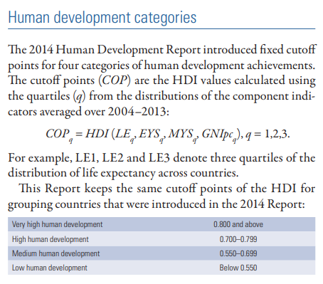

```{=tex}
\begin{center}
    \vspace*{0.5cm}
    \Huge\textbf{Modificaciones para el índice de desarrollo humano}
    
    \vspace{4cm}
    \includegraphics[width=0.2\textwidth]{logo_fceye.png}
  
    \vspace{0cm}
    \large{Facultad de Ciencias Económicas y Estadística, Universidad Nacional de Rosario}
    
    \vspace{0.5cm}
    \large{Alfonsina Badin, Ailen Salas, Augusto Raynaudo, Camila Matellicani, Julián L'heureux, Sofia Giaquinta}
    
    \vspace{0.5cm}
    \large{Junio 2024}
    
\end{center}
```
\clearpage

# Introducción

El desarrollo humano consiste en ampliar la riqueza de la vida humana, en lugar de simplemente la riqueza de la economía en la que viven los seres humanos. Es un enfoque centrado en las personas, en sus oportunidades y opciones[^1].

En lugar de dar por sentado que el crecimiento económico conducirá, automáticamente, a un mayor bienestar para todos, el desarrollo humano se enfoca en mejorar las vidas de las personas en un sentido más amplio. Por lo tanto, el crecimiento de los ingresos se considera un medio para el desarrollo, más que un fin en sí mismo. Bajo esta premisa, se tienen en cuenta también aspectos que impliquen desarrollar las capacidades de las personas, brindando la oportunidad y la libertad de utilizarlas, sin insistir en que las aprovechen.

[^1]: Fuente: [\textcolor{blue}{\underline{Human Development Reports, United Nations Development Programme.}}](https://hdr.undp.org/about/human-development).

En 1990 se calcula por primera vez por el Programa de las Naciones Unidas para el Desarrollo un indicador del desarollo humano bajo la definición mencionada, denominado Índice de Desarrollo Humano (IDH). Este es un indicador compuesto, extensamente utilizado a nivel internacional, que relaciona tres dimensiones para dar cuenta del grado de oportunidad efectiva de expandir las capacidades de las personas: una vida larga y saludable, el acceso al conocimiento y el tener un nivel estándar de vida decente. Es una forma de obtener el promedio de los logros de un área geográfica específica.

Para calcularlo, se toman las variables esperanza de vida, años esperados de escolaridad, años promedio de escolaridad y PBN per cápita de cada país. Se propone cuestionar el uso de estas variables o si es necesario incluir nuevas en el cálculo, ya que gracias a la facilidad que internet ofrece, se podrían tener en cuenta nuevas medidas de facil acceso.

El objetivo principal de la presente investigación es proponer una modificación para el IDH de forma que refleje en un sentido más integrado la naturaleza de cada país en relación al desarrollo humano. Dada la definición de desarollo humano antes mencionada, se propone tener en cuenta para el cálculo del IDH también aspectos sobre la sociedad, la discriminación, los derechos, la calidad de vida, desigualdades y las libertades civiles.

\pagebreak

# Índice de desarrollo humano

El IDH se calcula como una media geométrica de índices que representan a las tres dimensiones estudiadas: una vida larga y saludable, el conocimiento y un nivel de vida decente.

(EN LA FOTO cambiar indice de PBI por indice de ingreso para que quede igual a como lo nombramos)

 

$$IDH = \Bigl(\text{Índice de esperanza de vida}\times\text{Índice de educación}\times\text{Índice de ingreso}\Bigl)^{1/3}$$

Todos estos índices de dimensión se calculan de la siguiente forma:

$$\text{Índice de dimensión}=\frac{\text{valor actual - valor mínimo}}{\text{valor máximo - valor mínimo}}$$

Los valores mínimo y máximo están definidos para transformar la variable en un indicador con valores entre 0 y 1 y se llaman "cero natural" y "objetivo aspiracional", respectivamente.

### Vida larga y saludable 

La primer componente del IDH es vida larga y saludable, que sin dudas promueve el desarrollo humano y es primordial para mantener un buen estilo de vida. Actualmente, el indicador que representa este aspecto se obtiene a partir de la esperanza de vida al nacer. Entendiendo a la esperanza de vida al nacer como número medio de años que un recién nacido podría esperar vivir, si transcurriera su vida expuesto a las tasas de mortalidad específicas por sexo y edad vigentes en el momento de su nacimiento, para un año concreto, en un país, territorio o zona geográfica determinados.

Para el cálculo del IDH se transforma la esperanza de vida al nacer en un índice calculado con el índice de dimensión mencionado anteriormente. Para esto se definen valores mínimos y máximos de la esperaza de vida. La elección del cero natural para la esperanza de vida es de 20 años y está basada en evidencia histórica que muestra que ningún país en el siglo 20 ha tenido una esperanza de vida menor a los 20 años. El valor máximo u objetivo aspiracional está definido a los 85 años ya que es un objetivo realista al que muchos países pueden aspirar, especialmente por las constantes mejoras en las condiciones de vida y los avances médicos.

De esta forma el índice de esperanza de vida se calcula de la siguiente forma:

$$\text{Índice de esperanza de vida} = \frac{\text{Esperanza de vida al nacer}-20}{85-20}$$

## Conocimiento 

En representación de la dimensión "Conocimiento", se incluye al cálculo del IDH el índice de educación. Este se calcula como una media aritmética entre dos indicadores de dimensión para las variables años esperados de escolaridad y años promedio de escolaridad.

Los años esperados de escolaridad refieren al número de años de escolaridad que puede esperar recibir un niño en edad de comenzar la escuela, si los patrones vigentes de las tasas de matriculación por edad se mantienen a lo largo de su vida. Y los años medios de escolaridad son el  número promedio de años de educación recibidos por las personas de 25 años o más, calculado a partir de los niveles de logros educativos utilizando la duración oficial de cada nivel.

Resulta necesario aclarar que para la rama del conocimiento, al tomarse dos indicadores en vez de uno, primero se calcula el índice de dimensión de ambos y, a continuación, se obtiene la media aritmética de los dos índices resultantes.

$$\text{Índice de años esperados} = \frac{\text{Años esperados de escolaridad}-0}{18-0}$$

$$\text{Índice de años medios} = \frac{\text{Años medios de escolaridad}-0}{15-0}$$

Las sociedades pueden subsistir sin educación formal, lo que justifica la educación mínima de 0 años. El máximo de años esperados de escolaridad, 18, equivale a la obtención de un máster en la mayoría de los países. El máximo de años medios de escolaridad, 15, es el máximo previsto de este indicador para 2025.

El índice de educación queda definido entonces como la media aritmética de los índices mencionados:

$$\text{Índice de educación} = \frac{\text{Índice años esperados de escolaridad}+\text{Índice años medios de escolaridad}}{2}$$

## Nivel estándar de vida decente

Se considera que un nivel estándar de vida se puede alcanzar cuando la nación en la que se reside tiene un alto producto bruto interno per cápita, que refiere al valor monetario de la producción de bienes y servicios de demanda final de un país o región durante un período determinado para cada habitante de la población. Es por eso que el PBI fue la variable considerada en el cálculo del IDH en un principio.

Sin embargo, a partir del año 2010, para medir el nivel de vida, el producto nacional bruto (PNB) per cápita reemplaza al producto interno bruto (PIB) per cápita. Esto se debe a que en un mundo globalizado, suele haber grandes diferencias entre los ingresos de los residentes de un país y su producto interno. Parte de lo que ganan los habitantes se envía al extranjero, algunas personas reciben remesas del exterior y algunos países reciben considerables flujos de ayuda. 

Se define al producto nacional bruto (PNB) per cápita como los ingresos totales de una economía generados por su producción y la propiedad de los factores de producción, menos los ingresos pagados por el uso de factores de producción que son propiedad del resto del mundo, convertidos a dólares internacionales usando las tasas de la PPA, y divididos por la población a mitad del año.

Para comparar el estándar de vida entre los países, los datos deben ajustarse por la paridad del poder adquisitivo (PPA) a fin de eliminar las diferencias en el valor de un dólar entre países. Se entiende por paridad de poder adquisitivo (PPA) al tipo de cambio que refleja las diferencias de precios entre países y permite hacer comparaciones internacionales del producto e ingreso reales. En la tasa de PPA en US\$ (utilizada en este Informe), US\$1 en PPA tiene el mismo poder adquisitivo en la economía de cualquier país que US\$1 en los Estados Unidos de América. Para los datos correspondientes al 2019 se utiliza el PPA en US\$ base de 2011 para ajustar los valores de PNB per cápita.

En el _IDH_ se calcula el índice de ingreso como

$$\text{Índice de ingreso} = \frac{PNB - 100}{75.000-100}$$

El bajo valor mínimo para el Producto Nacional Bruto per cápita se considera en los 100 dólares, el uso de este valor se justifica por la considerable cantidad de producción de subsistencia y producción no comercial no medida en economías cercanas al mínimo, que no se captura en los datos oficiales. Por otro lado, el valor máximo se establece en 75.000 dólares per cápita. Kahneman y Deaton (2010) han demostrado que prácticamente no hay ganancia en desarrollo humano y bienestar con un ingreso anual per cápita superior a 75,000 dólares. Actualmente solo cuatro países (Brunei Darussalam, Liechtenstein, Qatar y Singapur) superan el techo de ingresos per cápita de 75,000 dólares.

\pagebreak

# Cuestionamiento

Durante la investigación se debate cada una de las dimensiones que componen el IDH con la finalidad de cuestionarlos e intentar una reformulación que sea más realista para los tiempos que corren.

Si bien se piensa que el calculo del IDH actual logra reflejar muchas cuestiones vinculadas a lo que hace que un país se pueda considerar con mayor o menor desarrollo humano, hay otros aspectos de lo que se define como desarrollo humano que no son tenidos en cuenta. 

En primer lugar, se menciona que no se toma por sentado que el crecimiento económico conduce a un mayor bienestar para todos sino que los ingresos se consideran un medio para el desarrollo, más que un fin en sí mismo. Esto indica que si bien una medida como el Producto Nacional Bruto podría ser un medio para explicar si un país esta más o menos desarrollado no podría definir esto por completo, ya que el tener un valor alto de _PNB_ no garantizaría el bienestar de toda la población. A partir de esta problemática surge la idea de implementar otra variable de corrección en esta dimensión para así poder tener en cuenta otras cuestiones del desarrollo humano para el nivel de vida de las personas.

Poniendo el foco en la dimensión de una vida larga y saludable, se puede identificar que en un principio el mismo nombre de esta dimensión no esta completamente explicado por la variable que se utiliza ya que la esperanza de vida solo indicaría si las personas tienen una vida larga o corta, pero no se determina qué tan saludable es. Por esta razón, en esta dimensión se considera importante incorporar otra variable que pueda tener en cuenta las condiciones en las que se vive, en cuanto a salud, en los distintos países.

Por otro lado, la definición de desarrollo humano menciona que este consiste en ofrecer oportunidades a las personas, no de insistir en que las aprovechen. Es decir, que las personas tengan la libertad de llevar a cabo la vida que ellos elijan sin imponerles cómo vivirla. Esto no se tiene en cuenta actualmente en el indice ya que no se calcula una dimensión de libertad. Se considera que podría ser una propuesta adecuada incluir una cuarta dimensión al indice de desarrollo humano que tenga en cuenta cuestiones relacionadas con la libertad y los derechos de las personas en su día a día. 

# Propuestas y modificaciones 

En esta sección se explica cada una de las modificaciones propuestas para este nuevo índice, acompañado del razonamiento realizado. Además, se muestran otras posibles propuestas que se podrían llevar a cabo en investigaciones futuras o descartadas del presente informe por diversas razones.

## Vida larga y saludable

### Debate

Como se mencionó anteriormente, tener una alta esperanza de vida sin dudas logra una vida larga, pero no necesariamente saludable. Esta variable no proporciona información sobre la calidad de vida en el horizonte de años de vida y si este horizonte se desarrolla con buena salud o, por el contrario, se desarrolla con alguna discapacidad o dependencia. Es por esto que se propone hacer uso de la __Esperanza de vida saludable al nacer__ para cuantificar este aspecto según la cantidad de años de calidad y no sólo en cantidad de años. 

Se considera condición de buena salud a la ausencia de limitaciones funcionales o de discapacidad ya que las enfermedades crónicas, los problemas mentales y la discapacidad física aumentan su prevalencia con la edad y reducen la calidad de vida de las personas que sufren estas condiciones de salud. *La esperanza de vida saludable al nacer es una medida que combina información de mortalidad y de morbilidad y se calcula, según el Instituto de Estadística español, en base al método Sullivan ( a traves de tablas de mortalidad) y al indicador de limitaciones generales de actividad de Euro-REVES (Network on Health Expectancy).*

El método de Sullivan es un método estadístico que combina la información de las tablas de mortalidad con datos sobre la prevalencia de morbilidades o limitaciones en la actividad. Ajustando las tablas de mortalidad con la prevalencia de morbilidad, se calcula la esperanza de vida libre de limitaciones, sumando los años de vida ajustados para obtener una medida integral de salud poblacional. Este método proporciona una visión clara de los años que se espera que una persona viva en buena salud, combinando la cantidad y calidad de vida.

En resumen, la organización mundial de la salud define al cálculo de la esperanza de vida saludable al nacer de la siguiente manera: 

$$HALE_x = \Biggl[\sum_{i=x}^w YWD_i\Biggl] \Bigl/ I_x$$

donde: 

- $YWD_x = L_x (1-D_x)$ son los años vividos sin discapacidad entre la edad $x$ y $x+5$

- $I_x$ es el número de sobrevivientes a las edad $x$

- $L_x$ es el total de años vividos entre la edad $x$ y $x+5$ de la tabla de vida 

- $D_x$ es la proporción de gente con discapacidad entre los años $x$ y $x+5$ 

Además, se evalúo la posible incorporación en el cálculo de esperanza de vida y de vida saludable a los 60 años para considerar el impacto de la salud en la población mayor en los distintos países. Sin embargo, se terminó considerado más sencillo utilizar unicamente los indicadores al nacer dado que se facilita la interpretación de la dimensión y estas medidas otorgan una visión más amplia de la longevidad y salud de la población a lo largo de toda su vida.

### Modificación en el cálculo del IDH

La esperanza de vida saludable al nacer se podría considerar una variable que contiene más información e identifica mejor a la dimensión "tener una vida larga y saludable". Ahora bien, ¿cómo incluirla al cálculo de IDH? Se han barajado algunas opciones:

**completar segun descriptivo**

- Reemplazar la esperanza de vida al nacer por la esperanza de vida saludable al nacer directamente en el cálculo del índice de salud. Para la transformación de dicha métrica en índice se calculó el mínimo y máximo de esta variable buscando que sea proporcional con el mínimo y máximo de la esperanza de vida al nacer.
$$min_{esp\;salud} = min_{esp\;vida}*\frac{min(esp\;salud)}{min(esp\;vida)}$$
Siendo:
- $min_{esp\;salud}$: valor fijado para el cero natural de la esperanza de vida saludable al nacer.
- $min_{esp\;vida}$: valor fijado para el cero natural de la esperanza de vida al nacer (20 años).
- $min(esp\;salud)$: valor mínimo observado de la esperanza de vida saludable al nacer entre los países evaluados.
- $min(esp\;vida)$: valor mínimo observado de la esperanza de vida al nacer entre los países evaluados.

De igual manera, se calcula el objetivo aspiracional para la esperanza de vida saludable al nacer. Y, una vez obtenidos ambos valores, se logra calcular el índice de la dimensión salud.

Algunas cuestiones que limitaron esta decisión fue el hecho de que no todos los países tienen esta medida, mientras que la esperanza de vida al nacer es más común y accesible. **De esta forma, se estaría subestimando el valor del IDH para aquellos países que no tienen la posibilidad de aportar un índice de salud, aún así teniendo un resultado alto en la esperanza de vida al nacer.**

- Tomar ambas variables y promediarlas. Una vez obtenido el promedio se calcula el índice de este eligiendo el cero natural y objetivo aspiracional con el criterio utilizado anteriormente. Explicar por qué lo descartamos
**Esta opción fue rápidamente descartada por el hecho de que ambas variables resumen aspectos muy similares, están muy relacionadas.**
$$prom=\frac{esp\;vida+esp\;salud}{2} \quad Dim_{salud} = \frac{prom-min}{max-min}$$

- Penalizar la esperanza de vida al nacer, disminuyendo su valor en aquellos países donde la esperanza de vida saludable al nacer es notablemente menor. Esta opción se lleva a cabo tranformando los dos valores en índices y después multiplicándolos. Sin embargo, esto causa que se penalice mucho el valor de la dimensión salud en aquellos países donde la esperanza de vida saludable es considerablemente menor que la esperanza de vida. Podría pensarse distintas ponderaciones para aminorar el peso de la esperanza de vida saludable en el cálculo de la dimensión. Para llevarlo a cabo se debería contar con un mayor conocimiento sobre la construcción de índices y el área de salud, por lo cual se decide no utilizar esta opción en el presente informe.
$$Dim_{salud}=Indice_{esp\;vida}*Indice_{esp\;salud}$$

- Otra opción es tomar los índices de esperanza de vida al nacer y esperanza de vida saludable al nacer, ya calculados con sus respectivos mínimos y máximos, y promediarlos.
$$Dim_{salud}=\frac{Índice_{esp\;vida}+Índice_{esp\;salud}}{2}$$

- Se podría pensar incoporar tambien la diferencia entre esperanza de vida al nacer y la esperanza de vida saludable al nacer de alguna manera. Sin embargo, esta idea es más subjetiva ya que valores grandes de esta diferencia se pueden considerar como positivos o negativos dependiendo de que lado se vea. Si bien primarimente se pensó que una gran diferencia significaba un país con menor desarrollo ya que simbolizaba que muchos de los años vividos eran en mala salud, luego se pensó que también esta gran diferencia podía simbolizar que el país en cuestión contaba con una gran tecnología y una avanzada medicina que hacía que los pacientes vivan más años a pesar de sus condiciones de salud. Si el desarrollo se plantea por el lado de avances en la humanidad entonces si la diferencia es grande se podría considerar como un mayor índice de desarrollo, por lo dicho anteriormente. Dada la complejidad y subjetividad del idea propuesta se decidió no incorporarla pero se deja plasmada la misma para profundizar este análisis en futuras investigaciones.

**Después de descartar las que no explicar por qué nos quedamos con salud (simplicidad ...)**

## Conocimiento

JUSTIFICCACIÓN DE NO CAMBIO CONOC

*Falta explicar cómo era antes de la modificación porque estamos de acuerdo*
Antes del año 2010, en el cálculo del IDH se tenían en cuenta las variables alfabetización y matriculación bruta en la dimensión de conocimientos.
A partir de la publicación del Informe de Desarrollo Humano en el año 2010, los años promedio de escolaridad sustituyeron a la alfabetización y la matriculación bruta se replanteó como los años esperados de escolaridad. Cada vez más países calculan con mayor frecuencia los años promedio de escolaridad. Dicha medida permite distinguir mejor entre países, mientras que los años esperados de escolaridad son consistentes con la reformulación de esta dimensión en términos de años. 

En todo el mundo, las personas hoy tienen el
mayor nivel de educación de la historia y este
resultado es válido para muchas mediciones
diferentes. Tomemos, por ejemplo, los años de
instrucción: una persona de 15 años de edad
o más en 1960 había cursado menos de cuatro
años de escuela. En 2010, esta cantidad se había
duplicado en todo el mundo y más que triplicado en los países en desarrollo (de 1,9 a 6,4
años). Desde el primer Informe sobre Desarrollo
Humano publicado en 1990, los años promedio
de escolaridad han aumentado en dos años y la
proporción bruta de matriculación, en 12 puntos porcentuales. Las tasas de alfabetismo, por
su parte, han crecido de 73% a 84%.
El progreso ha sido generalizado en este
campo. Desde 1970, el alfabetismo o los años
de instrucción no han disminuido en ningún
país. Y la educación ha llegado a muchas más
personas: desde 1960, la proporción de la población que ha asistido a la escuela ha aumentado
de 57% a 85%. Esto significa que muchos países
han tenido éxito en el campo de la enseñanza, al
menos según se desprende de las mediciones del
IDH convencional. Esto explica una de las principales motivaciones para realizar los ajustes que
analizamos en el recuadro 1.2 del capítulo 1.
El índice de educación promedio utilizado en el IDH, que combina información sobre
matriculación y alfabetismo, captura esta imagen general de avances masivos (figura 2.7). Al igual que en el caso de la salud, el gráfico térmico en el panel derecho muestra una fuerte
concentración en el tope de la distribución.
Pero incluso estos aumentos pueden subestimar los verdaderos avances. El alfabetismo y los
años de instrucción reflejan el acceso (o la falta
de acceso) a la educación por parte del segmento
de la población que hoy ha llegado a la adultez.
Por consiguiente, el progreso registrado quizás
no refleje los adelantos recientes en escolaridad
de los jóvenes. Las personas que no han asistido
a la escuela suelen tener más edad: en los países
en desarrollo, casi 36% de quienes hoy tienen
65 a 74 años nunca asistió a la escuela, cifra que
baja a sólo 7% entre quienes tienen 15 a 24 años.
La tasa de alfabetismo entre los jóvenes es superior a 95% en 63 de los 104 países de los cuales
disponemos información y es de 99% en otros
35 (incluso en naciones de ingreso medio como
Moldova y Samoa). A juzgar por estos resultados, pareciera que la falta de habilidades básicas
de redacción dejará de ser un obstáculo importante para acceder al conocimiento.
Las tasas de matriculación y los años esperados de escolaridad, es decir, los años de instrucción que pueden esperar tener quienes hoy son
niños una vez que hayan crecido, dadas las tasas
actuales, ilustran mejor el acceso a educación del
que hoy gozan los niños. Las tasas mundiales de
escolaridad promedio son de 100% o más en
educación primaria, tanto en los países desarrollados como en desarrollo, y ambos grupos han dado pasos gigantescos en los niveles de educación superiores, aunque los segundos aún tienen
grandes brechas que acortar (figura 2.8)54. Y no
sólo hay más niños en la escuela, sino que además, desde 1991, las tasas de quienes terminan la
educación primaria aumentaron de 84% a 94%.
La mayor matriculación también se refleja en los
años esperados de instrucción, que ascendieron
de nueve a 11 años entre 1980 y la fecha actual y
de cinco a ocho años en los países de IDH bajo.

Lo ideal sería que las mediciones de la dimensión de conocimientos incorporasen evaluaciones de calidad, tal como se ha hecho en varios informes sobre desarrollo humano nacionales y regionales. Por ejemplo, el Informe de los Estados Árabes de 2003 creó una medida tanto de la cantidad como de la calidad de la educación. Ésta ajusta los años promedio de instrucción con puntajes promedio en pruebas e incluye indicadores vinculados con medios de difusión, comunicaciones y científicos capacitados. Pero no existen buenas
medidas sobre la calidad de la educación para una cantidad suficiente de
países; las evaluaciones internacionales sobre conocimientos científicos
y matemáticos y habilidades de lecto-escritura de los jóvenes son instrumentos de gran valor, pero su cobertura es baja y su frecuencia, irregular.

Es por lo dicho anteriormente, que se decide dejar esta dimensión sin modificaciones pero con una propuesta futura de encontrar algún tipo de medición que pueda reflejar la calidad de la educación en los distintos paises.

## Nivel estándar de vida decente
ACORDARNOS EN EL CALCULO ACLARAR PPA CONSTANTE 2011 (XQ CALCULAMOS 2019)

### Debate 

Una de las principales preocupaciones al analizar el cálculo del índice de desarrollo humano actual fue la falta de consideración de uno de los primeros aspectos que se mencionan en la definición de desarrollo humano el cual establece que no se toma por sentado que el crecimiento económico conduce a un mayor bienestar para todos. Al utilizar el _PNB_ para medir la dimensión de nivel estándar de vida decente se esta tomando en cuenta solamente el desarrollo económico de un país para explicar que tan bueno es el nivel de vida de este. 

Se piensa que en ciertas situaciones puede haber un país con un gran valor de PNB pero en donde las riquezas no estén distribuidas equitativamente. Es decir, quizás este valor de PNB es alto por un bajo porcentaje de la población quien lo acumula mientras que existe un gran porcentaje de personas que no viven un nivel de vida decente. Es por esta razón que se considera incorporar en esta dimensión el indice de Gini. 

El coeficiente Gini es el método más utilizado para medir la desigualdad salarial. Es una herramienta analítica que suele emplearse para medir la concentración de ingresos entre los habitantes de una región, en un periodo de tiempo determinado. Fue desarrollada por el estadístico italiano Corrado Gini en 1912, representando con 0 a una igualdad perfecta y con un 100 a una desigualdad perfecta.

Este indicador se calcula como el área entre la curva de Lorenz y una línea hipotética que representa la igualdad total. Esta gráfica se utiliza a través de dos ejes de coordenadas, para identificar de forma sencilla el porcentaje de ingresos que corresponde a un porcentaje de población.

```{r fig.cap= "Índice de Gini en un caso hipotético", fig.align='center', echo=FALSE, message=FALSE, warning=FALSE, fig.height=3}
library(ggplot2)
library(dplyr)
library(ineq)
par(family = "serif")

set.seed(2024)

# Datos de ejemplo
renta <- runif(100, min = 1, max = 100)  # Datos de renta
renta <- renta[order(renta)]
poblacion <- seq(1, 100) / 100  # Población acumulada

# Cálculo de la curva de Lorenz
curva_lorenz <- ineq::Lc(renta)$L
poblacion_acumulada <- ineq::Lc(renta)$p

# Datos para el gráfico
data <- data.frame(poblacion = c(0, poblacion_acumulada), renta = c(0, curva_lorenz))

# Crear el gráfico
ggplot(data, aes(x = poblacion, y = renta)) +
  geom_ribbon(aes(ymin = renta, ymax = poblacion), fill = "#d4dff0", alpha = 0.7) +  # Área de desigualdad
  geom_line(color = "#543786", size = 1.0) +  # Curva de Lorenz
  geom_abline(intercept = 0, slope = 1, color = "#7bb8c0", linetype = "dashed", size = 1.0) +  # Recta de igualdad
  labs(title = "", x = "Población", y = "Renta") +
  geom_segment(aes(x = 0.8, xend = 0.60, y = 0.8, yend =0.8), color = "#7bb8c0") +
  geom_label(aes(x = 0.55,y=0.8,label="Recta de igualdad"), 
             family = "serif",fill = "#7bb8c0", color = "white",
             label.size = 0)+
  geom_segment(aes(x = 0.6, xend =0.40, y = 0.55, yend = 0.55), color = "#d4dff0") +
  geom_label(aes(x = 0.35, y = 0.55, label ="Desigualdad"),
             family = "serif",fill = "#d4dff0", color = "white",
             label.size = 0) +
  geom_segment(aes(x = 0.5, xend =0.60, y = 0.25, yend = 0.25), color = "#543786") +
  geom_label(aes(x = 0.70, y = 0.25, label ="Curva de Lorenz"),
             family = "serif",fill = "#543786", color = "white",
             label.size = 0) +
  theme_minimal() +
  theme(
    text = element_text(family = "serif"),
    axis.title.x = element_text(margin = margin(t = 10)),
    axis.title.y = element_text(margin = margin(r = 10))
  )
```

Para comprender la lógica, se puede observar en la Figura 1 que el 50% alcanza un 25% del ingreso mientras que un 75% de la población llega a más del 50% del ingreso, es decir, el ingreso que logra el 50% de la población lo alcanza el 20% contiguo, lo cual indica desigualdad ya que el ingreso no estaría equitativamente distribuído.

Se propone incorporar el índice de Gini al cálculo del IDH como (1-GINI) para que un país más desigual en términos salariales tenga menos desarrollo.

### Modificación en el cálculo del IDH

**completar** -------------------------------

### Modificación 

**explicar diferentes formas de meter indice de gini a esta dimension y cual se elige y porque**

## RAMA NUEVA
Cosas para justificar la rama nueva

## Debate 

*Informe IDH 2010*
El nuevo IDH poseía algunas debilidades, como lo reconocieron los autores; entre ellas, la dependencia de los promedios nacionales —que ocultaban sesgos de distribución— y la falta de una “medida cuantitativa de la libertad humana”. No obstante, logró plantear sin problemas la tesis central del Informe, declarada brevemente ya en la primera frase: “La verdadera riqueza de una nación está en su gente”.
Veinte años después, la brillantez conceptual y la importancia del paradigma original del desarrollo humano siguen siendo indiscutibles. Existe un consenso casi universal sobre la imposibilidad de medir el éxito de un país o el bienestar de un individuo únicamente a partir de su ingreso. Si bien el ingreso es fundamental, ya que sin recursos cualquier avance es difícil de lograr, también debemos tomar en cuenta si la gente puede llevar una vida saludable y prolongada, si tiene oportunidad de recibir educación y si es libre de aplicar sus conocimientos y talentos para configurar su propio destino. 
Hacia el futuro, los próximos informes deberán lidiar con temas aún más
complejos, entre ellos el ámbito cada vez más crítico de la sostenibilidad, la desigualdad y nociones más amplias de empoderamiento.
Mientras eso sucede, los nuevos desafíos que enfrentamos son aún más graves, como aquellos relacionados con la conservación del medio ambiente y la sostenibilidad de nuestro bienestar y de las libertades básicas. 

Durante los últimos 20 años, el IDH ha sido objeto de críticas. Algunas se relacionan con su construcción y composición, mientras
otras sugieren que debería ampliarse e incluir
más dimensiones, desde igualdad de género
hasta biodiversidad. Muchas de las inquietudes
son válidas. Pero, el objetivo no es crear un indicador incuestionable del bienestar, sino reorientar la atención hacia un desarrollo enfocado en
el ser humano y alimentar el debate sobre cómo
propiciar el progreso de las sociedades. Mientras más discutimos sobre qué debe incluirse o
no en el IDH —ya sea si tiene sentido agrupar
distintas categorías, cuánta importancia darle
a cada una o cómo conseguir más y mejores
datos— más se aleja el debate del estrecho enfoque en el crecimiento que dominó la reflexión
sobre el desarrollo.
El IDH ha resultado tremendamente fructífero como alternativa al enfoque basado solamente en el ingreso.

*VER A PARTIR DE LA PAG 29 DE INFORME 2020*
### Modificación IDH 

# Cálculo de IDH modif
Antes o como secciones de esta explicar de dónde sacamos los datos, qué hicimos con los datos faltantes.

## Estimación de datos faltantes

For a small number of countries missing one of the four indicators, the HDRO estimated the missing values using crosscountry regression models.
In this Report expected years of schooling were estimated for
Bahamas, Dominica, Equatorial Guinea, Haiti, Libya, Papua
New Guinea, Tonga, Trinidad and Tobago, and Vanuatu. Mean
years of schooling were estimated for Eritrea, Grenada and Saint
Kitts and Nevis.

# Resultados

- Rankear los países con IDH modificado y comparar (2 graficos países colores)

- Corr entre los IDH y el/los modificados

-	Resulta diferente o no al IDH ventajas y desventajas

- Idea mirando las tablas del informe del idh compara la clasificación de IDH con IDH modif por desigualdad viendo la diferencia. Ver si se podría y valdría la pena hacer lo mismo con el nuestro

# Cosas que quedan propuestas

# Conclusión 

# Categorías según desarrollo humano



Aggregate HDI values for country groups (by human development category, region and the like) are calculated by applying
the HDI formula to the weighted group averages of component
indicators. Life expectancy and GNI per capita are weighted
by total population, expected years of schooling is weighted by
population ages 5–24 and mean years of schooling is weighted
by population ages 25 and older.

\pagebreak


# GUÍA DE COSAS QUE TIENEN QUE ESTAR

- *Antes de nombrar la modificación que proponemos deberíamos nombrar algo de críticas al IDH y otras modificaciones que ya se hicieron (Informe ver en Documentos) y por qué buscamos una distinta que queremos mostrar.*
 EN 2010, se incorporan tres nuevos indicadores que capturan la desigualdad multidimensional, las disparidades de género y las privaciones extremas. El Índice de Desarrollo Humano ajustado por la Desigualdad, el Índice de Desigualdad de Género, así como el Índice de Pobreza Multidimensional
 *CAP 5 P106 DEL INFORME 2010*

- Orden posible:
    - *Intro + objetivo: definicion del desarrollo humano segun idh y segun nosotros*
    - terminos
    - Definición del calculo IDH actual y calculo de cada dimensión y explicación
    - Críticas / Otas modificaciones que ya se hicieron + Por qué proponemos igual hacer uno nuevo
    https://www.undp.org/sites/g/files/zskgke326/files/2023-09/notas_tecnicas.pdf
    - Explicación de modificaciones en cada dimensión (incluyendo posibilidades que se nos ocurrieron pero no hicimos o que descartamos o que estarían bueno hacer). Explicar tmb la de Derechos y libertades.
    - Cálculo final IDH modif (1 o los que sean) Aclarar acá o arriba de donde se obtuvieron los datos
    - Resultados (ver abajo opciones)
    - Conclusiones
    - En algún lado un apartado con cosas que quedan propuestas si es necesario.
    - Bibliografía
    
    
- Acordarnos de explicar para las variables que lo hayamos hecho que tomamos valores 2019 o más cercano


## eleccion 

Elección: el desarrollo humano consiste, fundamentalmente, en una mayor capacidad de elección. Se trata de ofrecer oportunidades a las personas, no de insistir en que las aprovechen. Nadie puede garantizar la felicidad humana, y las decisiones que tomen las personas son asunto suyo. El proceso de desarrollo -desarrollo humano- debería al menos crear un entorno para que las personas, individual y colectivamente, desarrollen todo su potencial y tengan una oportunidad razonable de llevar una vida productiva y creativa que valoren.


#Bibliografia

De donde sacamos los datos y lugares con info, informe idh...
