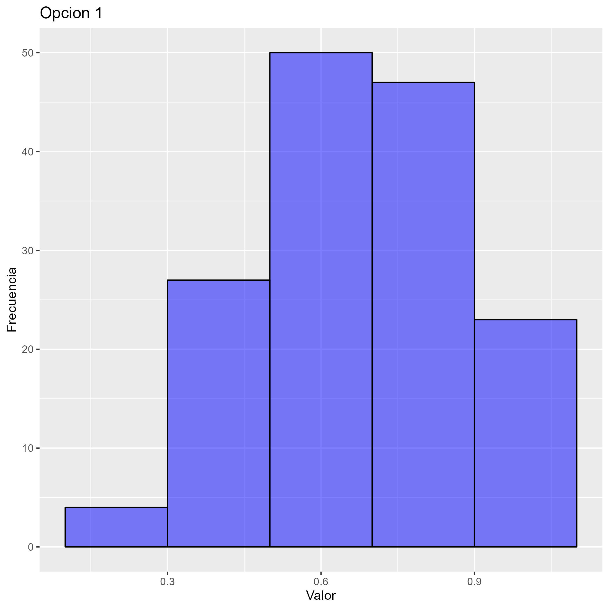
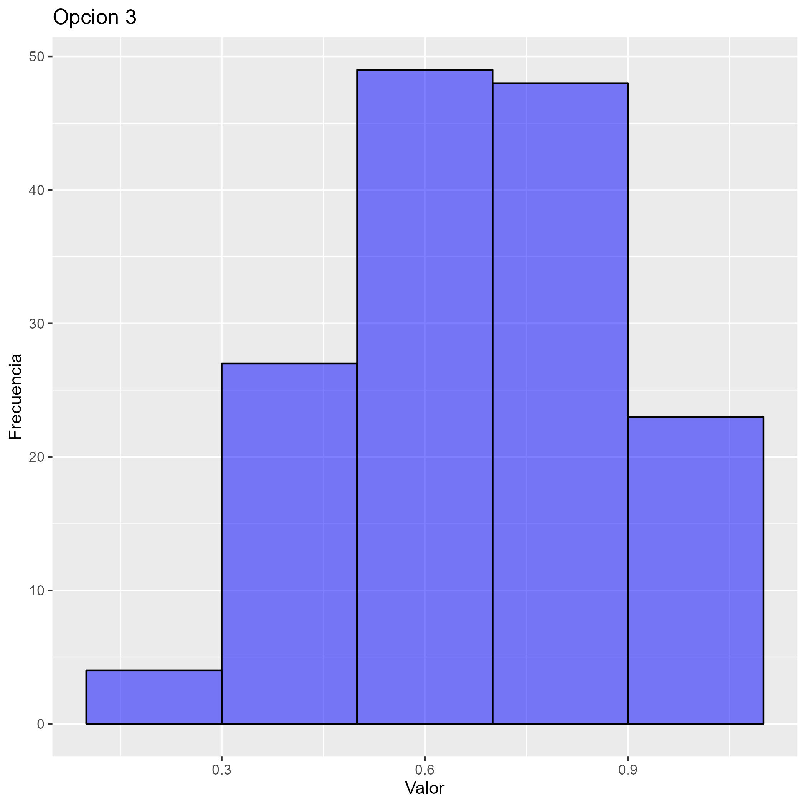
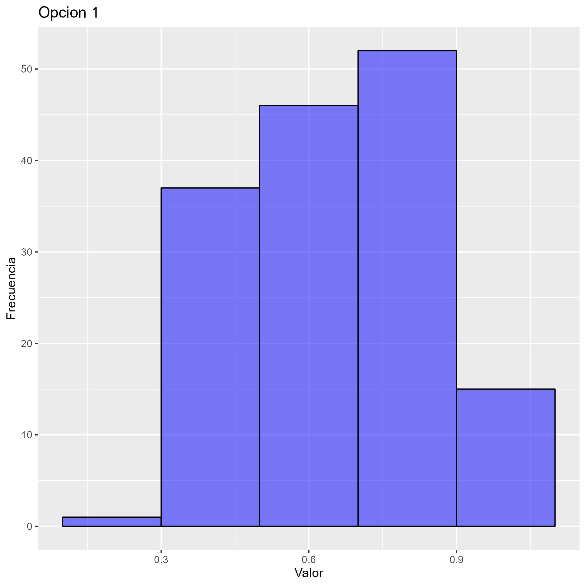
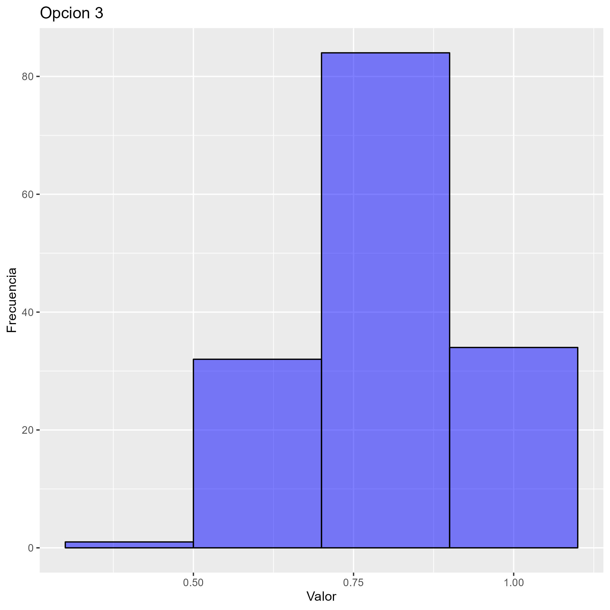

```{r}
#Carga de librerias
library("ggplot2")
library("gridExtra")
library("tidyverse")
library("tidyr")
source("depuración_ONU.R")

#Carga data frame para analisis descriptivo
bbdd_descrip <- datos_juntos_sinNA %>%
  select(codigo, Pais,dim_econ,gnipc2_2019,gini,vida_nacer,salud_nacer,dim_salud)

colnames(bbdd_descrip) <- c("Codigo","Pais","Dim_Econ","GNIPC","G","Vida_nacer","Salud_nacer","Dim_Salud")

```

# Indice Economico

GNIPC = GNI Per capita (Acotado en maximo y minimo seleccionados)
G = Indice de Gini

## Calculo actual 
$$Dim_{Econ0}=\frac{\ln(GNIPC)-\ln(100)}{\ln(75000)-\ln(100)}$$

## Opcion 1) 

GNIPCA = GNI Per cápita ajustado por Ginni
$$GNIPCA = GNIPC * (1-G/100)$$

$$Dim_{Econ1}=\frac{\ln(GNIPCA)-\ln(100)}{\ln(53377.0398)-\ln(100)}$$


```{r}
#Creacion nuevo indice economico1
bbdd_descrip$GNIPCA <- bbdd_descrip$GNIPC * (1- bbdd_descrip$G / 100)
bbdd_descrip$Dim_Econ1 <- (log(bbdd_descrip$GNIPCA)-log(100))/(log(53377.0398)-log(100))


#Boxplot

#Formato largo
bbddescrip_nuevo <- data.frame(
  idpais = rep(bbdd_descrip$Codigo, 2),
  valor = c(bbdd_descrip$Dim_Econ, bbdd_descrip$Dim_Econ1),
  tipo_variable = rep(c("indice0", "indice1"), each = nrow(bbdd_descrip)) 
)
options(device = "jpeg")  # Establecer el dispositivo gráfico a JPEG

boxecon_1 <- ggplot(bbddescrip_nuevo) +
  geom_boxplot(aes(x = tipo_variable, y = valor, fill = tipo_variable)) +
  labs(title = "Comparación indice económico original y opción 1", x = "Indice", y = "Valor") + scale_fill_manual(values = c("blue", "red")) +
  theme(axis.text.x = element_text(angle = 45, hjust = 1))

# Guardar el gráfico en un archivo JPEG con un nombre específico
ggsave("boxecon1.jpg", plot = boxecon_1)


# Histograma
# Original
histindice0_1 <- ggplot(bbdd_descrip, aes(x = Dim_Econ)) +
  geom_histogram(binwidth = 0.2, fill = "blue", color = "black", alpha = 0.5) +  # Agregar líneas alrededor de las barras
  labs(title = "Original", x = "Valor", y = "Frecuencia")


ggsave("histecon0.jpg", plot = histindice0_1)


# Opcion1
histindice1_1 <- ggplot(bbdd_descrip, aes(x = Dim_Econ1)) +
  geom_histogram(binwidth = 0.2, fill = "blue", color = "black", alpha = 0.5) +  # Agregar líneas alrededor de las barras
  labs(title = "Opcion 1", x = "Valor", y = "Frecuencia")

ggsave("histecon1.jpg", plot = histindice1_1)

# Calcula la correlación entre dos variables
correcon1 <- cor(bbdd_descrip$Dim_Econ, bbdd_descrip$Dim_Econ1)

# Muestra la correlación
print(correcon1)


```



## Opcion 2)

$$Dim_{Econ2}=\frac{\ln(GNIPC)-\ln(100)}{\ln(75000)-\ln(100)} * (1-G/100)$$
```{r}
#Creacion nuevo indice economico1
bbdd_descrip$Dim_Econ2 <- bbdd_descrip$Dim_Econ*(1-bbdd_descrip$G/100)


#Boxplot

#Formato largo
bbddescrip_nuevo <- data.frame(
  idpais = rep(bbdd_descrip$Codigo, 2),
  valor = c(bbdd_descrip$Dim_Econ, bbdd_descrip$Dim_Econ2),
  tipo_variable = rep(c("indice0", "indice2"), each = nrow(bbdd_descrip)) 
)
options(device = "jpeg")  # Establecer el dispositivo gráfico a JPEG

boxecon_2 <- ggplot(bbddescrip_nuevo) +
  geom_boxplot(aes(x = tipo_variable, y = valor, fill = tipo_variable)) +
  labs(title = "Comparación indice económico original y opción 2", x = "Indice", y = "Valor") + scale_fill_manual(values = c("blue", "red")) +
  theme(axis.text.x = element_text(angle = 45, hjust = 1))

# Guardar el gráfico en un archivo JPEG con un nombre específico
ggsave("boxecon2.jpg", plot = boxecon_2)


# Histograma


# Opcion2
histindice1_2 <- ggplot(bbdd_descrip, aes(x = Dim_Econ2)) +
  geom_histogram(binwidth = 0.2, fill = "blue", color = "black", alpha = 0.5) +  # Agregar líneas alrededor de las barras
  labs(title = "Opcion 2", x = "Valor", y = "Frecuencia")

ggsave("histecon2.jpg", plot = histindice1_2)

# Calcula la correlación entre dos variables
correcon2 <- cor(bbdd_descrip$Dim_Econ, bbdd_descrip$Dim_Econ2)

# Muestra la correlación
print(correcon2)


```


## Opcion 3) 

Aquellos valores de índice de Ginni que tengan valores menores a 0.3 se les asigna 0.3

GNIPCA = GNI Per cápita ajustado por Ginni
$$GNIPCA = GNIPC * (1-G/100)$$

$$Dim_{Econ3}=\frac{\ln(GNIPCA)-\ln(100)}{\ln(50491.7944)-\ln(100)}$$

```{r}
#Creacion nuevo indice economico1
bbdd_descrip$G_30 <- ifelse(bbdd_descrip$G >= 30, bbdd_descrip$G, 30)

bbdd_descrip$GNIPCA_30 <- bbdd_descrip$GNIPC * (1- bbdd_descrip$G_30 / 100)
bbdd_descrip$Dim_Econ3 <- (log(bbdd_descrip$GNIPCA_30)-log(100))/(log(50491.7944)-log(100))


#Boxplot

#Formato largo
bbddescrip_nuevo <- data.frame(
  idpais = rep(bbdd_descrip$Codigo, 2),
  valor = c(bbdd_descrip$Dim_Econ, bbdd_descrip$Dim_Econ3),
  tipo_variable = rep(c("indice0", "indice3"), each = nrow(bbdd_descrip)) 
)
options(device = "jpeg")  # Establecer el dispositivo gráfico a JPEG

boxecon_3 <- ggplot(bbddescrip_nuevo) +
  geom_boxplot(aes(x = tipo_variable, y = valor, fill = tipo_variable)) +
  labs(title = "Comparación indice económico original y opción 3", x = "Indice", y = "Valor") + scale_fill_manual(values = c("blue", "red")) +
  theme(axis.text.x = element_text(angle = 45, hjust = 1))

# Guardar el gráfico en un archivo JPEG con un nombre específico
ggsave("boxecon3.jpg", plot = boxecon_3)


# Histograma

# Opcion3
histindice1_3 <- ggplot(bbdd_descrip, aes(x = Dim_Econ3)) +
  geom_histogram(binwidth = 0.2, fill = "blue", color = "black", alpha = 0.5) +  # Agregar líneas alrededor de las barras
  labs(title = "Opcion 3", x = "Valor", y = "Frecuencia")

ggsave("histecon3.jpg", plot = histindice1_3)

# Calcula la correlación entre dos variables
correcon3 <- cor(bbdd_descrip$Dim_Econ, bbdd_descrip$Dim_Econ3)

# Muestra la correlación
print(correcon3)


```



## Opcion 4)

Aquellos valores de índice de Ginni que tengan valores menores a 0.3 se les asigna 0.3

$$Dim_{Econ4}=\frac{\ln(GNIPC)-\ln(100)}{\ln(75000)-\ln(100)} * (1-G/100)$$

```{r}
#Creacion nuevo indice economico1
bbdd_descrip$Dim_Econ4 <- bbdd_descrip$Dim_Econ*(1-bbdd_descrip$G_30/100)


#Boxplot

#Formato largo
bbddescrip_nuevo <- data.frame(
  idpais = rep(bbdd_descrip$Codigo, 2),
  valor = c(bbdd_descrip$Dim_Econ, bbdd_descrip$Dim_Econ4),
  tipo_variable = rep(c("indice0", "indice4"), each = nrow(bbdd_descrip)) 
)
options(device = "jpeg")  # Establecer el dispositivo gráfico a JPEG

boxecon_4 <- ggplot(bbddescrip_nuevo) +
  geom_boxplot(aes(x = tipo_variable, y = valor, fill = tipo_variable)) +
  labs(title = "Comparación indice económico original y opción 3", x = "Indice", y = "Valor") + scale_fill_manual(values = c("blue", "red")) +
  theme(axis.text.x = element_text(angle = 45, hjust = 1))

# Guardar el gráfico en un archivo JPEG con un nombre específico
ggsave("boxecon4.jpg", plot = boxecon_4)


# Histograma


# Opcion2
histindice1_4 <- ggplot(bbdd_descrip, aes(x = Dim_Econ4)) +
  geom_histogram(binwidth = 0.2, fill = "blue", color = "black", alpha = 0.5) +  # Agregar líneas alrededor de las barras
  labs(title = "Opcion 4", x = "Valor", y = "Frecuencia")

ggsave("histecon4.jpg", plot = histindice1_4)

# Calcula la correlación entre dos variables
correcon4 <- cor(bbdd_descrip$Dim_Econ, bbdd_descrip$Dim_Econ4)

# Muestra la correlación
print(correcon4)


```


# Indice de Salud

Vida_nacer: Esperanza de vida al nacer
Salud_nacer: Esperanza de salud al nacer

## Calculo actual 
$$Dim_{Salud0}=\frac{Vida_{nacer}-20}{85-20}$$

## Opcion 1)

$$Indice_{Salud}=\frac{Salud_{Nacer}-17.41872}{74.75077-17.41872}$$
$$Dim_{Salud1}=Indice_{Salud}*Dim_{Salud0}$$


```{r}
bbdd_descrip$Ind_Salud1 <- (bbdd_descrip$Salud_nacer-17.41872)/(74.75077-17.41872)
bbdd_descrip$Dim_Salud1 <- bbdd_descrip$Ind_Salud1*bbdd_descrip$Dim_Salud
#Boxplot

#Formato largo
bbddescrip_nuevo <- data.frame(
  idpais = rep(bbdd_descrip$Codigo, 2),
  valor = c(bbdd_descrip$Dim_Salud, bbdd_descrip$Dim_Salud1),
  tipo_variable = rep(c("indice0", "indice1"), each = nrow(bbdd_descrip)) 
)
options(device = "jpeg")  # Establecer el dispositivo gráfico a JPEG

boxsalud_1 <- ggplot(bbddescrip_nuevo) +
  geom_boxplot(aes(x = tipo_variable, y = valor, fill = tipo_variable)) +
  labs(title = "Comparación indice salud original y opción 1", x = "Indice", y = "Valor") + scale_fill_manual(values = c("blue", "red")) +
  theme(axis.text.x = element_text(angle = 45, hjust = 1))

# Guardar el gráfico en un archivo JPEG con un nombre específico
ggsave("boxsalud1.jpg", plot = boxsalud_1)


# Histograma
# Original
histindice0_2 <- ggplot(bbdd_descrip, aes(x = Dim_Salud)) +
  geom_histogram(binwidth = 0.2, fill = "blue", color = "black", alpha = 0.5) +  # Agregar líneas alrededor de las barras
  labs(title = "Original", x = "Valor", y = "Frecuencia")


ggsave("histsalud0.jpg", plot = histindice0_2)


# Opcion1
histindice1_2 <- ggplot(bbdd_descrip, aes(x = Dim_Salud1)) +
  geom_histogram(binwidth = 0.2, fill = "blue", color = "black", alpha = 0.5) +  # Agregar líneas alrededor de las barras
  labs(title = "Opcion 1", x = "Valor", y = "Frecuencia")

ggsave("histsalud1.jpg", plot = histindice1_2)

# Calcula la correlación entre dos variables
corrsalud1 <- cor(bbdd_descrip$Dim_Salud, bbdd_descrip$Dim_Salud1)

# Muestra la correlación
print(corrsalud1)


```





## Opcion 2)

$$Dim_{Salud2}=\frac{Salud_{Nacer}-17.41872}{74.75077-17.41872}$$
```{r}
bbdd_descrip$Dim_Salud2 <- (bbdd_descrip$Salud_nacer-17.41872)/(74.75077-17.41872)


#Boxplot

#Formato largo
bbddescrip_nuevo <- data.frame(
  idpais = rep(bbdd_descrip$Codigo, 2),
  valor = c(bbdd_descrip$Dim_Salud, bbdd_descrip$Dim_Salud2),
  tipo_variable = rep(c("indice0", "indice2"), each = nrow(bbdd_descrip)) 
)
options(device = "jpeg")  # Establecer el dispositivo gráfico a JPEG

boxsalud_2 <- ggplot(bbddescrip_nuevo) +
  geom_boxplot(aes(x = tipo_variable, y = valor, fill = tipo_variable)) +
  labs(title = "Comparación indice salud original y opción 2", x = "Indice", y = "Valor") + scale_fill_manual(values = c("blue", "red")) +
  theme(axis.text.x = element_text(angle = 45, hjust = 1))

# Guardar el gráfico en un archivo JPEG con un nombre específico
ggsave("boxsalud2.jpg", plot = boxsalud_2)


# Histograma
# Opcion2
histindice2_2 <- ggplot(bbdd_descrip, aes(x = Dim_Salud2)) +
  geom_histogram(binwidth = 0.2, fill = "blue", color = "black", alpha = 0.5) +  # Agregar líneas alrededor de las barras
  labs(title = "Opcion 2", x = "Valor", y = "Frecuencia")

ggsave("histsalud2.jpg", plot = histindice2_2)

# Calcula la correlación entre dos variables
corrsalud2 <- cor(bbdd_descrip$Dim_Salud, bbdd_descrip$Dim_Salud2)

# Muestra la correlación
print(corrsalud2)

```


## Opcion 3)

$$SaludVida_{nacer} = Salud_nacer * Vida_nacer$$
$$Dim_{Salud3}=\frac{SaludVida_{nacer}-18.70936}{79.87539-18.70936}$$
```{r}
bbdd_descrip$SaludVida_nacer <- (bbdd_descrip$Vida_nacer+bbdd_descrip$Salud_nacer)/2
min_saludvida_nacer <- 20*(min(bbdd_descrip$SaludVida_nacer)/min(bbdd_descrip$Vida_nacer))
max_saludvida_nacer <- 85*(max(bbdd_descrip$SaludVida_nacer)/max(bbdd_descrip$Vida_nacer))
bbdd_descrip$Dim_Salud3 <- (bbdd_descrip$SaludVida_nacer-18.70936)/(79.87539-18.70936)

#Boxplot

#Formato largo
bbddescrip_nuevo <- data.frame(
  idpais = rep(bbdd_descrip$Codigo, 2),
  valor = c(bbdd_descrip$Dim_Salud, bbdd_descrip$Dim_Salud3),
  tipo_variable = rep(c("indice0", "indice3"), each = nrow(bbdd_descrip)) 
)
options(device = "jpeg")  # Establecer el dispositivo gráfico a JPEG

boxsalud_3 <- ggplot(bbddescrip_nuevo) +
  geom_boxplot(aes(x = tipo_variable, y = valor, fill = tipo_variable)) +
  labs(title = "Comparación indice salud original y opción 3", x = "Indice", y = "Valor") + scale_fill_manual(values = c("blue", "red")) +
  theme(axis.text.x = element_text(angle = 45, hjust = 1))

# Guardar el gráfico en un archivo JPEG con un nombre específico
ggsave("boxsalud3.jpg", plot = boxsalud_3)


# Histograma
# Opcion2
histindice3_2 <- ggplot(bbdd_descrip, aes(x = Dim_Salud3)) +
  geom_histogram(binwidth = 0.2, fill = "blue", color = "black", alpha = 0.5) +  # Agregar líneas alrededor de las barras
  labs(title = "Opcion 3", x = "Valor", y = "Frecuencia")

ggsave("histsalud3.jpg", plot = histindice3_2)

# Calcula la correlación entre dos variables
corrsalud3 <- cor(bbdd_descrip$Dim_Salud, bbdd_descrip$Dim_Salud3)

# Muestra la correlación
print(corrsalud3)

```


## Opcion 4)

$$Dim_{Salud4}=\frac{Dim_{Salud0}+Dim_{Salud2}}{2}$$

```{r}
bbdd_descrip$Dim_Salud4 <- (bbdd_descrip$Dim_Salud+bbdd_descrip$Dim_Salud2)/2

#Boxplot

#Formato largo
bbddescrip_nuevo <- data.frame(
  idpais = rep(bbdd_descrip$Codigo, 2),
  valor = c(bbdd_descrip$Dim_Salud, bbdd_descrip$Dim_Salud4),
  tipo_variable = rep(c("indice0", "indice4"), each = nrow(bbdd_descrip)) 
)
options(device = "jpeg")  # Establecer el dispositivo gráfico a JPEG

boxsalud_4 <- ggplot(bbddescrip_nuevo) +
  geom_boxplot(aes(x = tipo_variable, y = valor, fill = tipo_variable)) +
  labs(title = "Comparación indice salud original y opción 4", x = "Indice", y = "Valor") + scale_fill_manual(values = c("blue", "red")) +
  theme(axis.text.x = element_text(angle = 45, hjust = 1))

# Guardar el gráfico en un archivo JPEG con un nombre específico
ggsave("boxsalud4.jpg", plot = boxsalud_4)


# Histograma
# Opcion2
histindice4_2 <- ggplot(bbdd_descrip, aes(x = Dim_Salud4)) +
  geom_histogram(binwidth = 0.2, fill = "blue", color = "black", alpha = 0.5) +  # Agregar líneas alrededor de las barras
  labs(title = "Opcion 4", x = "Valor", y = "Frecuencia")

ggsave("histsalud4.jpg", plot = histindice4_2)

# Calcula la correlación entre dos variables
corrsalud4 <- cor(bbdd_descrip$Dim_Salud, bbdd_descrip$Dim_Salud4)

# Muestra la correlación
print(corrsalud4)
```


